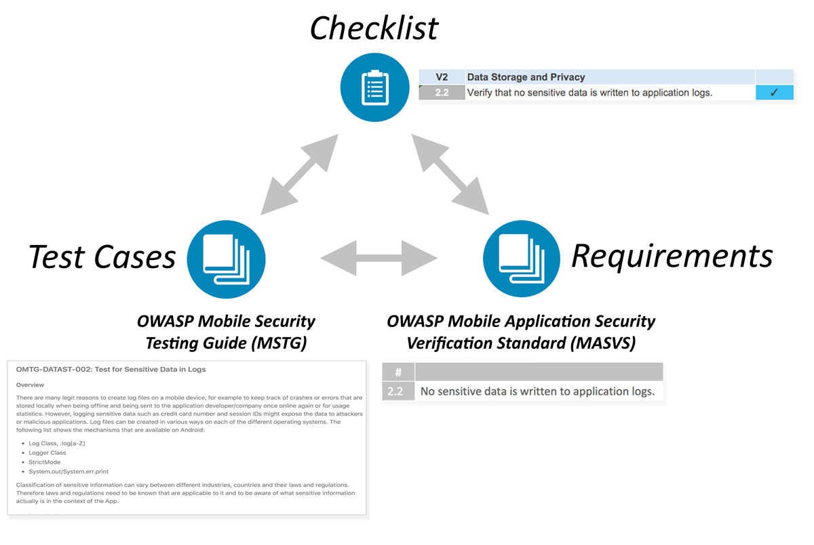

# Overview

## Introduction to the OWASP Mobile Security Testing Guide

新しい技術は新しいセキュリティ上のリスクを生み出すのは世の常であり、モバイルコンピューティングも例外ではありません。モバイルアプリのセキュリティ上の懸念は、従来のデスクトップソフトウェアとはいくつかの重要な点において異なります。現代のモバイル用オペレーティングシステムは、従来のデスクトップオペレーティングシステムよりも安全性が高いとは言えますが、モバイルアプリケーションの開発中にセキュリティを慎重に検討していなければ、やはり問題は発生する可能性があります。データストレージ、アプリ間通信、暗号APIの適切な使用、安全なネットワーク通信などは、これらの考慮事項の一部に過ぎません。

### Key Areas in Mobile Application Security

多くのモバイルアプリの侵入テストツールは、そのバックグラウンドにネットワークやウェブアプリケーションの侵入テストなどのノウハウを持っており、それはモバイルアプリのテストに対しても非常に有益なものになります。ほぼすべてのモバイルアプリがバックエンドサービスと通信しており、これらのサービスはデスクトップマシンからウェブアプリに対して行うものと同じ種類の攻撃を受けやすい傾向にあります。モバイルアプリは、攻撃対象となる領域が狭く、それゆえインジェクション攻撃やそれに類似する攻撃に対してセキュリティが強化されている点で異なります。代わりに、モバイルセキュリティを強化するために、デバイスとネットワーク上のデータ保護に優先順位を付ける必要があります。

モバイルアプリのセキュリティにおける主要分野について説明します。

#### Local Data Storage

ユーザーの資格情報や個人情報などの機密データを保護することは、モバイルセキュリティに不可欠です。 アプリがローカルストレージやプロセス間通信（IPC）などのオペレーティングシステムが提供するAPIを不適切に使用している場合、そのアプリは機密データを同じ端末で実行されている他のアプリに漏えいする可能性があります。また、クラウドストレージ、バックアップ、またはキーボードキャッシュにデータが漏えいすることもあります。さらに、モバイルデバイスは、他のタイプのデバイスに比べて簡単に紛失または盗難される可能性があるため、個人がデバイスに物理的にアクセスしてデータを取得する可能性が高くなります。

モバイルアプリ開発に際し、ユーザーデータを保存する際には細心の注意が必要です。たとえば、適切なキーストレージAPIを使用して、ハードウェアでバックアップされたセキュリティ機能を利用できるようにすることができます。

断片化は、Androidデバイスで特に問題となる問題です。 すべてのAndroidデバイスがハードウェアで保護された安全なストレージを提供するわけではなく、多くのデバイスでAndroidの古いバージョンが使用されています。これらの古くなったデバイスでサポートされるアプリケーションでは、重要なセキュリティ機能がない古いバージョンのAndroid APIを使用して作成する必要があります。最大限のセキュリティを確保するには、一部のユーザーを除外することになってでも、現在のAPIバージョンでアプリを作成することを推奨します。

#### Communication with Trusted Endpoints

モバイルデバイスは、他の(潜在的に悪意のある)クライアントと共有されるパブリックなWiFiネットワークを含む、さまざまなネットワークに接続します。これにより、シンプルな手法から複雑なものまで、古いものから新しいものまで、幅広いネットワークベースの攻撃機会が生まれます。モバイルアプリとリモートサービスエンドポイントの間で交換される情報の機密性と完全性を維持することは重要です。基本的な要件として、モバイルアプリは適切な設定でTLSプロトコルを使用してネットワーク通信用の安全な暗号化チャネルを設定する必要があります。

#### Authentication and Authorization

ほとんどの場合、ユーザーをリモートサービスにログインさせることは、モバイルアプリのアーキテクチャ全体の不可欠な部分です。ほとんどの認証および認可ロジックはエンドポイントで発生しますが、モバイルアプリ側には実装上の課題もいくつかあります。Webアプリケーションとは異なりモバイルアプリは指紋認証などの端末認証機構のように長時間のセッショントークンを格納することがよくあります。これによりログインが速くなり、ユーザーエクスペリエンスが向上します（誰も複雑なパスワードをわざわざ入力したくないですよね）が、さらに問題の複雑さは増し、エラーの余地が生じます。

モバイルアプリケーションアーキテクチャでは、認証を別のサービスに委譲する認証フレームワーク（OAuth2など）や、認証プロセスを認証プロバイダに委託するケースも増えています。 OAuth2を使用すると、クライアント側の認証ロジックを同じデバイス（システムブラウザなど）上の他のアプリケーションに委託することができます。セキュリティテスターは、さまざまな権限フレームワークとアーキテクチャの長所と短所を把握している必要があります。

#### Interaction with the Mobile Platform

モバイルオペレーティングシステムアーキテクチャは、古典的なデスクトップアーキテクチャとは重要な点で異なります。たとえば、すべてのモバイルオペレーティングシステムでは、特定のAPIへのアクセスを制御するパーミッションの仕組みが実装されています。また、アプリケーションが信号やデータを交換できるように、よりリッチな（Android）またはリッチではない（iOS）プロセス間通信（IPC）機能も提供しています。これらのプラットフォーム固有の機能には、独自の落とし穴があります。たとえば、IPC APIが悪用されると、機密データや機能が意図せずにデバイス上で実行されている他のアプリに公開される可能性があります。

#### Code Quality and Exploit Mitigation

従来のインジェクション攻撃やメモリ管理の問題は、攻撃が成立する可能性が低いため、モバイルアプリではほとんど見られません。モバイルアプリは、殆どの場合、信頼できるバックエンドサービスやUIとのみ通信するため、アプリに多くのバッファオーバーフローの脆弱性があったとしても、通常、これらの脆弱性は有用な攻撃経路を開けません。同じことが、クロスサイトスクリプティング（XSSは攻撃者がWebページにスクリプトを挿入できる脆弱性）のようなブラウザの悪用にも当てはまりますが、これはWebアプリケーションで非常に一般的です。ただし、常に例外はあります。理論的にはXSSはモバイルでも可能な場合がありますが、個人が利用できるXSSの問題を見ることは非常にまれです。XSSの詳細については、[**Testing Code Quality**](https://github.com/OWASP/owasp-mstg/blob/master/Document/0x04h-Testing-Code-Quality.md#user-content-testing-for-cross-site-scripting-flaws) の **Testing for Cross-Site Scripting Flaws** を参照してください。

このインジェクション攻撃とメモリ管理の問題からの保護は、アプリ開発者がコードが苦手であることから逃避できるということではありません。セキュリティのベストプラクティスに従うことで、改ざんに対して復元力のある強化された（セキュアな）リリースビルドが実現します。 コンパイラやモバイルSDKが提供する無料のセキュリティ機能は、セキュリティを強化し、攻撃を緩和するのに役立ちます。

#### Anti-Tampering and Anti-Reversing

あなたが会話の中で決して触れるべきではない3つのことがあります: 宗教、政治、およびコードの難読化です。多くのセキュリティ専門家は、クライアント側の保護を完全に却下しています。しかし、ソフトウェア保護制御はモバイルアプリケーションの世界で広く使用されているため、セキュリティテスターはこれらの保護に対処する方法を必要としています。明確な目的と現実的な期待を念頭に置いて用いられ、かつセキュリティの代替措置とされないという条件付きであれば、我々はクライアント側の保護が役に立つとと信じています。

## The OWASP Mobile AppSec Verification Standard

本ガイドは、MASVSと密接に関連しています。MASVSはモバイルアプリのセキュリティモデルを定義し、モバイルアプリ向けの一般的なセキュリティ要件を示しています。このガイドは、設計者、開発者、テスター、セキュリティ専門家、消費者が安全なモバイルアプリの品質を定義し、理解するのに有効です。MSTGは、MASVSにが提供するセキュリティ要件と同じ基本セットにマッピングされ、コンテキストに応じて、個別に使用することも、異なる目的を達成するために組み合わせることもできます。

たとえば、MASVSの要件はアプリの計画とアーキテクチャの設計段階で使用できますが、チェックリストとテストガイドは、手動セキュリティテストのベースラインとして、または開発中もしくは開発後の自動セキュリティテストのテンプレートとして役立ちます。[Mobile App Security Testing chapter](https://github.com/OWASP/owasp-mstg/blob/master/Document/0x04b-Mobile-App-Security-Testing.md)では、モバイルアプリの侵入テストにチェックリストとMSTGを活用する方法について説明します。

## Navigating the Mobile Security Testing Guide

MSTGには、MASVSで指定されたすべての要件の記述が含まれています。MSTGには、次の主要なセクションが含まれています。

1. [General Testing Guide](https://github.com/OWASP/owasp-mstg/blob/master/Document/0x04-General-Testing-Guide.md) には、モバイルアプリのセキュリティテスト手法と一般的な脆弱性分析手法が含まれており、これはモバイルアプリのセキュリティにも適用できます。また、認証やセッション管理、ネットワーク通信、暗号化など、OSに依存しない追加の技術テストケースも含まれています。

2. [Android Testing Guide](https://github.com/OWASP/owasp-mstg/blob/master/Document/0x05-Android-Testing-Guide.md) では、セキュリティの基本、セキュリティテストケース、リバースエンジニアリングテクニックと予防、改ざん技術と予防といったAndroidプラットフォームのモバイルセキュリティテストが含まれています。

3. [iOS Testing Guide](https://github.com/OWASP/owasp-mstg/blob/master/Document/0x06-iOS-Testing-Guide.md) では、iOS、セキュリティテスト、リバースエンジニアリング技術と予防、改ざん技術と予防といったiOSプラットフォームのモバイルセキュリティテストが含まれています。
