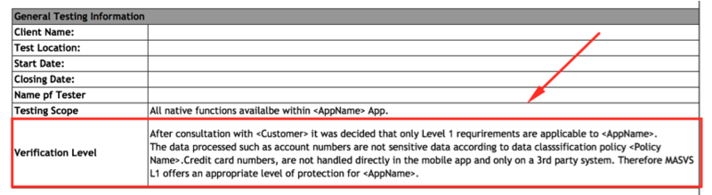
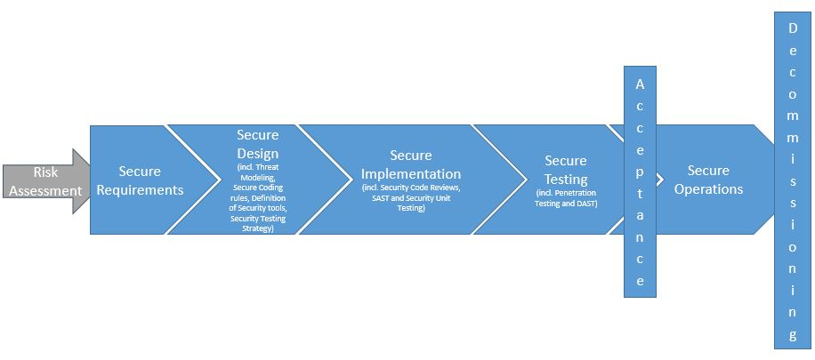

## Mobile App Security Testing

以下のセクションでは、一般的なセキュリティテストの原則と重要な用語について簡単に説明します。ここで説明するコンセプトは、他のタイプの侵入テストで見られるコンセプトとほぼ同じです。そのため、経験豊富なテスターであれば、コンテンツの一部は既に把握済みのものかもしれません。

このガイドでは、静的および動的解析によるモバイルアプリのセキュリティ評価に関する包括的な表現として「モバイルアプリのセキュリティテスト」という表現を用いています。「モバイルアプリの侵入テスト」や「モバイルアプリのセキュリティレビュー」などの用語は、セキュリティ業界では一貫して使用されていませんが、これらの用語はほぼ同じです。モバイルアプリのセキュリティテストは、より大きなセキュリティアセスメントであったり、クライアント/サーバーアーキテクチャやモバイルアプリが利用するサーバーサイドAPIなどを対象に含む侵入テストの一部であることが一般的です。

このガイドでは、2つの状況でモバイルアプリのセキュリティテストを扱います。1つ目は、開発ライフサイクルの終了時に行われる「古典的な」セキュリティテストです。この状況では、テスト担当者はほぼ完成した、または製品化可能なバージョンのアプリケーションにアクセスし、セキュリティの問題を特定し、(通常は壊滅的な)レポートを作成します。もう1つの状況は、ソフトウェア開発のライフサイクルの初めから行われる要件実装とセキュリティテストの自動化が特徴です。同じ基本要件とテストケースが両方のコンテキストに適用されますが、上位レベルでの手法とクライアント対話のレベルが異なります。

### Principles of Testing

#### White-box Testing versus Black-box Testing

コンセプトを定義することから始めましょう:

- **Black-box testing** は、テスターがテスト対象のアプリケーションに関する情報を持たずに遂行されます。このプロセスは「ゼロナレッジテスト」と呼ばれることがあります。このテストの主な目的は、公に入手可能で発見可能な情報のみを用いるという点で、テスターが真の攻撃者のように振る舞うことが出来るということにあります。
- **White-box testing**（「フルナレッジテスト」とも呼ばれます）は、ブラックボックステストと異なり、テスターがアプリを完全に知っているという意味で全く反対になります。ここでいうナレッジには、ソースコード、ドキュメント、図などが含まれます。このアプローチは、ブラックボックステストよりもはるかに高速なテストを可能にします。なぜなら、透明性があることと、追加知識が得られれば、より洗練された細かいテストケースを構築できるからです。
- **Gray-box testing** は、前述の2つのテストタイプの間にあるすべてのテストです。テスターに​​はいくつかの情報が提供され（通常は認証情報のみ）、その他の情報はテストの過程で発見されることが意図されています。このタイプのテストは、テストケースの数、コスト、スピード、およびテストの範囲において興味深い妥協点にあります。グレーボックステストは、セキュリティ業界で最も一般的なテストです。

できるだけ効率的にテスト時間を使用できるように、ソースコードを要求することを強くお勧めします。テスターのコードアクセスは、外部からの攻撃をシミュレートすることはありませんが、テスターがコードレベルですべての識別された異常または疑わしい動作を検証できるようにすることで、脆弱性の識別を簡略化します。ホワイトボックステストは、アプリがそれまでににテストされていない場合に行う手法です。

Androidでの逆コンパイルは簡単ですが、ソースコードは難読化されている可能性があり、難読化には時間がかかります。したがって、テスターがソースコードにアクセスするもう1つの理由は、時間の制約になります。

#### Vulnerability Analysis

脆弱性分析は通常、アプリ内の脆弱性を探すプロセスです。これは手動で行うこともできますが、主に自動化されたスキャナを使用して主な脆弱性を特定します。静的および動的解析は、脆弱性分析の分類になります。

#### Static versus Dynamic Analysis

Static Application Security Testing (SAST) は、ソースコードを手動または自動で分析することによって、アプリケーションのコンポーネントを実行することなく検査します。OWASPでは、[Static Code Analysis](https://www.owasp.org/index.php/Static_Code_Analysis "OWASP Static Code Analysis")にて静的解析に関するテクニック、長所、弱点、および制限などを把握するのに役立つ情報を提供しています。

Dynamic Application Security Testing (DAST) では、アプリケーションを実行させる必要があります。このタイプの分析は、手動または自動で行うことができます。通常、静的解析によって得られるような情報は提供されませんが、ユーザの観点から興味のある要素（assets、機能、エントリポイントなど）を検出するための良い方法です。

静的解析と動的解析を定義したので、深く掘り下げてみましょう。

#### Static Analysis

静的解析では、モバイルアプリのソースコードがレビューされ、セキュリティ管理の適切な実装が確実に行われます。ほとんどの場合、自動/手動のハイブリッドな手法が用いられます。自動スキャンにて、わかりやすい問題を網羅的に検出し、テスターは特定の使用状況を念頭に置いてコードベース深く検査するといったことが出来ます。

##### Manual Code Review

手動コードレビューでは、テスターはモバイルアプリケーションのソースコードを手動で解析し、セキュリティ脆弱性探します。その方法は、grepなどを用いた基本的なキーワード検索からソースコードの行単位での調査まで様々存在します。IDE（Integrated Development Environments）は、基本的なコードレビュー機能を提供することが多く、さまざまなツールで拡張できます。

手動コード分析の一般的なアプローチでは、「executeStatement」や「executeQuery」などのデータベース関連のメソッド呼び出しなど、特定のAPIやキーワードを検索して、主要なセキュリティ脆弱性にあたりをつけていきます。これらの文字列を含むコードは、手作業による分析の出発点です。

自動コード分析とは対照的に、手動コードレビューは、特にコードが技術的には安全だが、論理的に欠陥があるというような場合に、ビジネスロジックの脆弱性、標準への違反、および設計上の欠陥などを識別するのに非常に適しています。このようなシナリオは、自動コード解析ツールでは検出されない可能性があります。

手動コードレビューには、モバイルアプリケーションに使用される言語とフレームワークの両方に熟練した専門のコードレビュー担当者が必要です。完全なコードレビューは、特に多数の依存関係を持つ大きなコードベースを使用すると、非常に時間がかかります。

##### Automated Source Code Analysis

自動分析ツールを使用すると、Static Application Security Testing（SAST）のレビュープロセスを高速化できます。ソースコードでは、あらかじめ定義されたルールや業界のベストプラクティスに準拠しているかどうかを確認し、検出されたすべての違反の検出結果または警告とフラグのリストを表示します。いくつかの静的解析ツールでは、コンパイルされたアプリケーションに対してのみ実行され、一部には元のソースコードが、また一部には統合開発環境（IDE）のライブ解析プラグインとして実行される必要があります。

静的コード分析ツールには、モバイルアプリを分析するために必要なルールとセマンティクスに関する多くの情報が組み込まれていますが、特にターゲット環境用に構成されていない場合は誤検出が多く発生する可能性があります。セキュリティ専門家は、常に出力された結果をレビューする必要があります。

「テストツール」の章には、静的解析ツールのリストが含まれています。このツールのリストは、このマニュアルの最後にあります。

#### Dynamic Analysis

DASTの焦点は、リアルタイム実行によるアプリのテストと評価です。動的解析の主な目的は、実行中のプログラムのセキュリティ上の脆弱性や弱点を発見することです。動的分析は、モバイルプラットフォームレイヤーとバックエンドサービスおよびAPIの両方で行われ、モバイルアプリが送受信するrequest, responseのパターンなどを分析します。

動的解析は、通常、通信経路におけるデータの漏えい、認証と認可の問題、サーバーの構成エラーなど、最も一般的な種類の攻撃に対して十分な保護を提供するセキュリティメカニズムをチェックするために使用されます。

#### Avoiding False Positives

##### Automated Scanning Tools

自動テストツールは、アプリコンテキストに対する機密性の欠如が課題です。これらのツールは、関連性のない潜在的な問題を特定する可能性があります。そのような結果は「偽陽性」と呼ばれます。

たとえば、セキュリティテスターは一般的にウェブブラウザで利用可能な脆弱性を報告しますが、モバイルアプリには関連しません。この偽陽性は、バックエンドサービスをスキャンするために使用される自動テストツールが、通常のブラウザベースのWebアプリケーションに基づいているために発生します。 CSRF（クロスサイトリクエストフォージェリ）やクロスサイトスクリプティング（XSS）などの問題がそれに応じて報告されます。

CSRFを例にしましょう。CSRFの成功には以下が必要です。

- ログインしているユーザーに、脆弱なサイトにアクセスするために使用されたWebブラウザの悪質なリンクを開くように誘導する機能。
- クライアント（ブラウザー）は、requestに対してセッションCookieまたはその他の認証トークンを自動的に追加する必要があります。

モバイルアプリはこれらの要件を満たしていません。WebViewとCookieベースのセッション管理を使用しても、ユーザーがクリックした悪意のあるリンクは、別のCookieストアを持つデフォルトブラウザで開きます。

アプリケーションにWebViewが含まれている場合、XSS（Stored Cross-Site Scripting）が問題になることがあります。また、JavaScriptインターフェイスをエクスポートするとコマンド実行につながることもあります。しかし、クロスサイトスクリプティングは、上記の理由で問題になることはめったにありません（存在しているかどうかは疑わしいものですが、エスケープする出力は単にベストプラクティスです）。

>いずれの場合でも、リスクアセスメントを実行する際にシナリオを悪用することを検討してください。スキャンツールの出力を盲目的に信頼しないでください。

##### Clipboard

入力フィールドにデータを入力するとき、クリップボードを使用してデータをコピーできます。クリップボードはシステム全体でアクセス可能であるため、アプリケーションによって共有されます。このデータの共有は悪意のあるアプリから悪用され、クリップボードに保存された機密データが漏えいする可能性があります。

iOS 9以前は、悪意のあるアプリがバックグラウンドでペーストボードを監視し、定期的に`[UIPasteboard generalPasteboard] .string`を取得するということがありました。iOS 9以降では、ペーストボードのコンテンツにはフォアグラウンドからしかアクセスできないため、パスワード盗聴の攻撃対象がクリップボードから大幅に削減されました。

Androidでは、パスワードがクリップボードに保存されているかどうかを確認するための[PoC ](https://arstechnica.com/information-technology/2014/11/using-a-password-manager-on-android-it-may-be-wide-open-to-sniffing-attacks/ "Password Sniffing")がリリースされています。[パスワード入力フィールドの貼り付けを無効にすること](https://github.com/OWASP/owasp-masvs/issues/106 "Disabling Pasting for Password Input Fields")は、MASVS 1.0の要件でしたが、いくつかの理由で削除されました：

- アプリの入力フィールドに貼り付けるのを抑止することは、ユーザーが機密情報をコピーすることを抑止することには繋がりません。ユーザーがそれを貼り付けることができないことに気づく前に、情報が既にコピーされているため、悪意のあるアプリは既にクリップボードを盗聴していることになります。
- パスワードフィールドでパスワードの貼り付けを無効にすると、覚えやすい強度の低いパスワードを選択することになったり、パスワードマネージャを使用できなくなったりして、元のアプリの安全性をかえって損なうことになります。

アプリを使用しているときは、他のアプリが[Facebook app](https://www.thedailybeast.com/facebook-is-spying-on-your-clipboard "Facebook Is Spying On Your Clipboard")のようにクリップボードを継続的に読み込んでいることに気づくはずです。それでも、パスワードをコピーして貼り付けることは、セキュリティリスクであり、アプリでは解決できません。
アプリを使用する際には、他のアプリがクリップボードを継続的に読んでいることに気づくべきです。でした。それでも、パスワードをコピーして貼り付けることは、セキュリティリスクであり、アプリでは解決できません。

#### Penetration Testing (a.k.a. Pentesting)

従来のアプローチでは、開発プロセスが終了する際のビルドなど、アプリの最終的な、もしくはほぼ最終直前のビルドを対象として全面的なセキュリティテストを行います。開発プロセスの最後にテストする際には、 [Mobile App Security Verification Standard (MASVS)](https://github.com/OWASP/owasp-masvs "OWASP MASVS") と関連するチェックリストをテストのベースラインとして推奨しています。一般的なセキュリティテストは、以下のように構成されています。

- **preparation** - 適用されるセキュリティ管理策、組織のテスト目標、機密データの特定など、セキュリティテストの範囲を定義する。より一般的には、この準備にはクライアントと情報、定義などを同期するというだけでなく、テスター（多くの場合第三者）を法的に保護する目的があります。書面による許可なしにシステムを攻撃することは、世界の多くの地域で違法であることを忘れないでください！
- **Intelligence Gathering** - 一般的なコンテキスト理解を得るためにアプリの **環境** および **アーキテクチャ** のコンテキストを分析します。
- **Mapping the Application** - これはここまでのフェーズの情報に基づいており、自動化されたスキャンと手動でアプリを調査することで補完することができます。マッピングによって、アプリ、そのエントリーポイント、保持するデータなどのアプリに関する理解と主な潜在的脆弱性についての理解に繋がります。これらの脆弱性は、悪用された際の被害に応じてランク付けされ、セキュリティテスターが優先順位を付けることになります。このフェーズには、テストケースの作成も含まれます。
- **Exploitation** - この段階では、セキュリティテスターは前のフェーズで特定された脆弱性を利用してアプリに侵入しようとします。この段階は、発見された脆弱性が真に影響があるものかどうかを判断するのに必要です。。
- **Reporting** - クライアントに不可欠なこのフェーズでは、セキュリティテスターは、攻撃の範囲（例えば、テスターが不正にアクセスできるデータ)を含めて、自分が遂行できた攻撃について報告します。

##### Preparation

アプリをテストする際のセキュリティレベルは、予め決定されている必要があります。セキュリティ要件は、プロジェクトの開始時に決定されていなくてはなりません。組織が異なれば、テストに対してニーズも異なれば利用可能なリソースも異なります。MASVSでは、レベル1(L1)の管理作がすべてのモバイルアプリケーション用となっていますが、技術的、ビジネス的要件からレベル1(L1)およびレベル2(L2)のチェックリスを通して実行するというのはテストの網羅性を決定する良い方法です。

組織は、特定の地域で異なる規制および法的責任を負うことがあります。アプリが機密データを処理しなくとも、（業界の規制や地方の法律のために）いくつかのL2に相応する要件が関連している可能性があります。例えば、二要素認証（2FA）は、金融系のアプリケーションに対しては義務であり、国の中央銀行および/または金融規制当局によって必須とされています。

開発プロセスの初期段階で定義されたセキュリティ目標/管理策は、ステークホルダーとの議論中にレビューされることもあります。管理策の中には、MASVSコントロールに準拠するものもあれば、組織やアプリケーションに固有のものもあります。

関係者は、すべてのセキュリティテストのベースラインを定義するため、チェックリストの決定と範囲に同意する必要があります。

###### Coordinating with the Client

実際のテスト環境を準備することは難しい作業です。たとえば、企業内のWiFiやネットワークの制限により、クライアントの施設内で行われる動的解析が妨げられることがあります。企業ポリシーでは、企業内ネットワークでルート化した端末の利用を禁止したり、（ハードウェアおよびソフトウェアを問わず）ネットワークテストツールの使用を禁止することがあります。ルート検出やその他のリバースエンジニアリング対策を実装しているアプリケーションは、以降の解析に多大な苦労が発生するかもしれません。

セキュリティテストには、モバイルアプリのネットワークトラフィックの監視と操作、アプリデータファイルの検査、API呼び出しのインスツルメントなど、多数の侵入的なタスクが含まれます。証明書のピン割り当てやルート検出などのセキュリティ制御によって、これらのタスクが妨げられ、テストが大幅に遅くなる可能性があります。

これらの課題を解決するには、開発チームから対象アプリの2つの異なるビルドバージョンを貰う必要があります。実装された管理策が正しく機能しているかどうかを判断し、簡単にバイパスできるかどうかを判断できるように、1つはリリース版のビルドである必要があります。もうひとつは、特定のセキュリティ制御機構が無効化されたデバッグ版のビルドでなければなりません。2つの異なるビルドをテストすることは、すべてのテストケースをカバーする最も効率的な方法です。

テストを担当する関与度によっては、このアプローチは不可能かもしれません。ホワイトボックステスト用にプロダクションビルドとデバッグビルドの両方を要求することは、すべてのテストケースを完了し、アプリケーションのセキュリティ成熟度を明確に示すのに役立ちます。クライアントは、プロダクションアプリとそのセキュリティ管理の有効性の評価に焦点を当てたブラックボックステストを好むかもしれません。

両方のタイプのテストの範囲は、準備段階で検討する必要があります。たとえば、セキュリティ制御を調整する必要があるかどうかは、テスト前に決定する必要があります。追加のトピックについては以下で説明します。

###### Identifying Sensitive Data

機密情報の分類は、業界と国によって異なります。さらに、組織は機密データの閲覧には制限を設け、機密情報を明確に定義するデータ分類ポリシーを持つ必要があります。

データアクセスには3つの一般的な状態があります。

- **At rest** - データはファイルまたはデータストアに格納されています。
- **In use** - アプリケーションがそのアドレス空間にデータをロードしています。
- **In transit** - IPC（プロセス間通信）中など、モバイルアプリとエンドポイント間や端末上のプロセス間で通信されるデータ。

各状態におけるセキュリティテストの適切さというものは、データの重要性やアクセスの可能性に依存しています。たとえば、アプリケーションメモリに格納されているデータは、コアダンプ経由でアクセスするWebサーバーのデータよりも脆弱になる可能性があります。これは、攻撃者がWebサーバーよりもモバイルデバイスに物理的にアクセスする可能性が高いためです。

データ分類ポリシーが利用できない場合、一般に機密扱いとみなされる以下の情報リストを参照してください。

- ユーザー認証情報（認証情報、PINなど）
- なりすましに利用される個人情報（PII）：社会保障番号、クレジットカード番号、銀行口座番号、健康情報
- 個人を識別できるデバイス識別子
- 風評被害および/または金銭被害につながる非常に機密性の高いデータ
- 法的に保護が求められているデータ
- アプリケーション（またはその関連システム）によって生成され、他のデータまたはシステム自体を保護するために使用される技術データ（例えば、暗号化キー）。

 定義されていない機密データの漏えいを検出することは非常に困難なため、「機密データ」の定義はテスト開始前に決定されている必要があります。

##### Intelligence Gathering

Intelligence Gatheringには、アプリケーションのアーキテクチャ、ビジネスにおけるユースケース、およびアプリケーションが動作するコンテキストに関する情報の収集が含まれます。それらの情報は、「environmental」や「architectural」として分類されます。

Intelligence gathering involves the collection of information about the app's architecture, the business use cases the app serves, and the context in which the app operates. Such information may be classified as "environmental" or "architectural."

###### Environmental Information

環境情報には、以下が含まれます。

- 組織のアプリケーションの目標。アプリケーションの機能情報は、ユーザーとアプリケーションとのやり取りの有り様につながるため、その一部の表層は他に比べて攻撃者に狙われやすくなる可能性があります。
- 関連業界。業種によってリスクプロファイルが異なる場合があります。
- ステークホルダーと投資家。誰がアプリに関心を持ち、その責任を負うのかを理解すること。
- 内部プロセス、ワークフロー、および組織構造。組織固有の内部プロセスおよびワークフローは、[ビジネスロジックを活用する](https://www.owasp.org/index.php/Testing_for_business_logic "Testing business logic"))機会を作り出す可能性があります。

###### Architectural Information

アーキテクチャに関する情報は次のとおりです。

- **The mobile app：** アプリケーションがデータにアクセスしてそれを処理する方法、他のリソースと通信してユーザーセッションを管理する方法、脱獄やルート化さえた端末で動作されていることを検出して動作を停止するかどうか。
- **The Operating System:** アプリケーションが実行されているオペレーティングシステムおよびOSのバージョン（AndroidまたはiOSのバージョン制限を含む）、アプリケーションがモバイルデバイス管理（MDM）コントロールを備えたデバイスで実行されるかどうかや、関係するするOSの脆弱性など。
- **Network:** 安全な通信プロトコル（例えば、TLS）を使用しているかどうか、ネットワークトラフィックの暗号化を保護するための強力な鍵および暗号アルゴリズム（例えばSHA-2）の使用、エンドポイントを検証するための証明のpinningの設定など。
- **Remote Services:** アプリケーションが利用するリモートサービス。それらが被害を受けているかによってクライアントに対する影響も変化します。

##### Mapping the Application

セキュリティテスターがアプリケーションとそのコンテキストに関する情報を持っていれば、次のステップは、エントリーポイント、機能、およびデータを識別するなど、アプリの構造とコンテンツをマッピングすることです。

侵入テストがホワイトボックスまたはグレーボックスのパラダイムで実行される場合、プロジェクト内部の文書（アーキテクチャダイアグラム、機能仕様、コードなど）によって速度が大幅に向上する可能性があります。ソースコードが入手可能であれば、SASTツールを使用することで、脆弱性に関する貴重な情報（SQLインジェクションなど）を得ることができます。
DASTツールはブラックボックステストをサポートし、アプリケーションを自動的にスキャンします。テスターは数時間または数日を要しますが、スキャナは数分で同じタスクを実行できます。しかし、自動ツールには限界があり、事前にプログラムされた想定範囲の中でしか見つけることが出来ないという点を覚えておくことが重要です。したがって、自動ツールの結果を増やすには人間の分析が必要な場合があります（直観はセキュリティテストの鍵となることが多くあります）。

脅威モデリングは重要な成果物です。ワークショップの文書は、通常、セキュリティテスターが必要とする多くの情報（エントリポイント、資産、脆弱性、重大度など）の識別を大幅にサポートします。テスターは、このような文書の可用性についてクライアントと話し合うことを強く推奨します。脅威モデリングは、ソフトウェア開発ライフサイクルの重要な部分でなければなりません。通常、プロジェクトの初期段階で発生します。

[threat modeling guidelines defined in OWASP](https://www.owasp.org/index.php/Application_Threat_Modeling "OWASP Application Threat Modeling")は、一般にモバイルアプリに適用されます。

##### Exploitation

残念なことに、時間や費用などの問題により、自動スキャナ（例えば、脆弱性分析用）を介した多くのアプリケーションマッピングでは制限が生じます。これまでのフェーズで特定された脆弱性は興味深いかもしれませんが、5つの軸に則って関連性を確認する必要があります。

- **潜在的被害** - この脆弱性を悪用することによって生じうる被害
- **再現性** - 攻撃の再現性
- **攻撃可能性** - 攻撃の実行の容易さ
- **影響を受けるユーザー** - 攻撃の影響を受けるユーザーの数
- **検出可能性** - 脆弱性の発見しやすさ

予想に反して、一部の脆弱性は悪用には至らず、あったとしても精々軽微な被害に留まることがあります。また、別の脆弱性は一見すると無害に見えるかもしれませんが、現実的な条件下では非常に危険であったりすることもあります。開発段階を慎重に踏んだテスターは、脆弱性とその影響を特徴づけることにより、テストステーをサポートします。

#### Reporting

セキュリティテスターの調査結果は、明確に文書化されている場合にのみ、クライアントにとって価値があります。 良い報告書には、以下のような情報(それに限るものではないが)を含みます。

- エグゼクティブサマリー
- 範囲とコンテキスト（例えば、対象システム）の記述
- 検査手法
- 情報源（クライアントによって提供されたものや検査を通じて発見されたもの）
- 優先順位の高い調査結果（DREADによる脅威評価によって高い脅威とされたもの）
- 詳細な調査結果
- 各問題を修正するための推奨事項

### Security Testing and the SDLC

セキュリティテストの原則はここ最近で根本的な変化を生じてはいませんが、ソフトウェア開発の技術は劇的に変化しました。アジャイルの普及はソフトウェア開発のスピードアップをもたらしましたが、セキュリティテスターは信頼性の高いソフトウェアを引き続き提供しながら、迅速かつ機敏に対応する必要が生まれました。

次のセクションでは、この進化にフォーカスして、最新のセキュリティテストについて説明します。

#### Security Testing during the Software Development Life Cycle

結局のところ、ソフトウェア開発はあまり古いものではないので、フレームワークなしで開発を終えることがしばしば確認されます。我々はソースコードが増えるにつれて、作業を管理する最小限のルールの必要性を経験してきました。

過去には、「ウォーターフォール」手法が最も広く採用されました。開発は事前定義されたシーケンスを持つステップごとに進められました。単一のステップでしか手戻りできない仕組みは、ウォーターフォール手法の重大な欠点でした。彼らは重要でポジティブな特性（構造を提供し、テスターが努力が必要な場所を明確にし、理解しやすくするなど）を持っていますが、ネガティブなものも持っています（非常に緩慢な縦割り構造を生み出してしまう)。

ソフトウェア開発が成熟するにつれて、競争は激しくなり、開発者は市場の変化に迅速に対応する必要が生まれ、予算を抑えたソフトウェア製品を開発する必要がありました。より低コストな開発という考えは一般的になり、小規模なチームが協力することで組織の縦割り構造を打破しました。そして「アジャイル」の考えが生まれ（スクラム、XP、RADはアジャイル実装のよく知られた例です）、より自律的なチームをより迅速に連携させることができるようになったのです。

セキュリティはもともとソフトウェア開発の不可欠な要素ではありませんでした。運営チームがネットワーク上で動かす際に、運用でカバーするといったものに過ぎませんでした。ソフトウェアプログラムが境界内に配置されている場合、統合されていなくてもセキュリティの実現は可能でしたが、Web、モバイル、およびIoTテクノロジで新しい種類のソフトウェア利用が発生したことで、このコンセプトは時代遅れになりました。今日、脆弱性を運用でカバーすることは非常に困難であるため、セキュリティは **ソフトウェア自身** に実装する必要があります。

>「SDLC」は、セキュリティがソフトウェア開発プロセスの一部であるという考えを内在化するため、次のセクションの「セキュアSDLC」と互換的に使用されます。同様の考え方で、DevSecOpsという名前を使用して、セキュリティがDevOpsの一部であるという事実を強調します。

#### SDLC Overview

##### General Description of SDLC

SDLCは常に同じ手順で構成されます（全体的なプロセスは、ウォーターフォールのパラダイムでは順番に実行され、Agileのパラダイムでは反復的に実行されます）。

- アプリケーションおよびそのコンポーネントがリスクプロファイルを識別するために **リスクアセスメント** を行います。これらのリスクプロファイルは、通常、組織のリスク選好度および適用される規制要件に依存します。リスクアセスメントは、インターネットを介してアプリケーションにアクセスできるかどうか、アプリケーションが処理および格納するデータの種類などの要因にも基づいています。金融、マーケティング、産業などあらゆる種類のリスクを考慮する必要があります。データ分類ポリシーでは、機密性の高いデータとその保護方法を指定します。
- **セキュリティ要件** は、機能要件が明らかとなる開発サイクルもしくはプロジェクトの開始時に決定されます。ユースケースが作成されると、**Abuse Cases** が追加されます。チーム（開発チームを含む）には、必要に応じてセキュリティトレーニング（セキュアコーディングなど）を行うことができます。[OWASP MASVS](https://mobile-security.gitbook.io/masvs/"OWASP MASVS")を使用して、リスクアセスメントフェイズに基づいてモバイルアプリケーションのセキュリティ要件を判断することができます。機能やデータクラスが追加されたときの要件の反復的なレビューは、特にアジャイルプロジェクトでは一般的です。
- **脅威モデリング** は、基本的に脅威の識別、列挙、優先順位付け、および初期の処理であり、アーキテクチャの開発と設計の進展として実行する必要がある基本的なアーティファクトです。 **セキュリティアーキテクチャ** は、脅威モデルのファクターの１つであり、脅威モデリングのフェーズ後に（ソフトウェアとハ​​ードウェアの両方の面で）改善することが出来ます。 **セキュアコーディングルール** が確立され、使用される **セキュリティツール** のリストが作成されることになります。これで **セキュリティテスト** の戦略が明確になりました。
- すべてのセキュリティ要件および設計上の考慮事項は、開発/運用チームがセキュリティ要件を開発ワークフローに緊密に統合するために使用するアプリケーションライフサイクルマネジメント（ALM）システム（問題追跡ツールとも呼ばれます）に保存する必要があります。開発者がすばやく参照できるように、セキュリティ要件には関連するソースコードスニペットが含まれている必要があります。バージョン管理下にあり、これらのコードスニペットのみを含む専用リポジトリを作成することは、伝統的なアプローチ（WordやPDFにガイドラインを保存する）よりも有益な安全なコーディング戦略です。
- **ソフトウェアを安全に開発する**。コードセキュリティを強化するには、**セキュリティコードレビュー**、**静的アプリケーションセキュリティテスト**、**セキュリティユニットテスト** などを完了する必要があります。これらのセキュリティ活動の質的類似性が存在するにもかかわらず、セキュリティ上の欠陥（例えば、入力検証の欠落、すべてのリソースの解放など）のために、コードのレビュー、分析、テストなどのセキュリティに同じロジックを適用する必要があります。
- 次は待望のリリーステストとなります。手動と自動の**侵入テスト**（ "Pentests"）です。**動的アプリケーションセキュリティテスト** は通常、この段階でも実行されます。
- ソフトウェアがすべてのステークホルダーに **認定** され、**承認** されると、それは **Operation** チームに安全に移行し、製品とすることができます。
- 最後に、見逃されることが多い段階は、利用がが終了した後のソフトウェアの安全な **廃止** です。

下の図は、すべてのフェーズと成果物を示しています。

プロジェクトの一般的なリスクプロファイルに基づいて、いくつかの成果物を簡素化（またはスキップ）したり、他のものを追加することができます（formal intermediary approvals, formal documentation of certain pointsなど）。 **SDLCはソフトウェア開発に伴うリスクを軽減するためのものであり、その目的のためにコントロールを設定するのに役立つフレームワークです。** これはSDLCの一般的な記述です。常にこのフレームワークをプロジェクトに合わせます。

##### Defining a Test Strategy

テスト戦略によって、SDLC中に実行されるテストとその頻度が決定されます。ソフトウェア製品の最終版が、クライアントからの法律/マーケティング/企業チームなどに基づく一般的なセキュリティ対策方針を満たしているかを確認するために、テスト戦略は利用されます。
テスト戦略は、通常、リスクが明らかにされた後（開始フェーズ中）からコード開発（セキュア実装フェーズ前）が開始されるまでの間、セキュアデザインフェーズ中に作成されます。この戦略には、リスク管理、以前の脅威モデリング、セキュリティエンジニアリングなどの活動からのインプットが必要です。

テスト戦略は正式に書かれている必要はありません。ストーリー（アジャイルプロジェクト内の）で記述したり、チェックリストにすばやく列挙したり、特定のツールのテストケースとして指定するといったことでも問題ありません。しかし、テスト戦略の実装は、それを定義したチーム以外のチームで行うため、このテスト戦略は確実に共有する必要があります。さらに、技術チームは、いずれのチームに対して過剰な負担とならないようにすることを皆で合意しておく必要があります。

テスト戦略は、次のようなトピックに対処します。

- 目標とリスク記述
- 目標を達成するための計画、リスク軽減、どのテストが必須か、誰が実行するか、どのように実行されるか
- 合否基準

テスト戦略の進捗状況と有効性を把握するには、評価基準を定義し、プロジェクト中に継続的に更新し、定期的に周知する必要があります。関連する評価基準を選択することについては、書籍全体を書くことができます。評価基準はリスクプロファイル、プロジェクト、組織に依存していると言えるでしょう。評価基準の例は次のとおりです。

- 正常に実装されたセキュリティ管理に関連するストーリーの数
- セキュリティ制御と機密機能に関する単体テストのコードの網羅率
- 静的解析ツールを使用して各ビルドで検出されたセキュリティバグの数
- セキュリティバグのバックログの傾向（緊急度におうじてソートしたりする）

これらは示唆にすぎません。他の評価基準のほうがプロジェクトにより関連しているかもしれません。評価基準は、プロジェクト管理者に、何が起こっているか、何を改善する必要があるかについての明確かつ総合的な視点を与え、プロジェクトを管理下に置く強力なツールです。

社内チームによるテストと独立した第三者によるテストの区別は重要です。内部テストは通常​​、日常業務の改善に役立ちますが、第三者テストは組織全体の改善に役立ちます。内部テストはかなり頻繁に行うことが出来ますが、第三者テストはたいてい1年に1,2回行われる程度です。また、前者は後者より低コストです。両方とも必要なものであり、多くのセキュリティ上の要請などでは独立した第三者からのテストが義務づけられています。なぜなら、そのようなテストはより信頼できるものであるからです。

#### Security Testing in Waterfall

##### What Waterfall Is and How Testing Activities Are Arranged

基本的に、SDLCは開発ライフサイクルの使用を特に義務付けたりしていません。セキュリティはどんな状況にも対処できる(しなくてはならない)からです。

ウォーターフォールモデルは21世紀以前に人気がありました。最も有名なモデルは「V字モデル」と呼ばれ、フェーズが順番に実行され、1ステップのみ手戻り出来るというものです。
このモデルにおけるテストは順番に実行され、ライフサイクルにおけるアプリケーション開発の大部分が完了したタイミングでその多くが行われます。この進め方だと、問題が特定された際に、コードが変更されることがあっても、プロジェクトの始めに設定されたアーキテクチャやその他の要因の変更はほとんど不可能となります。

#### Security Testing for Agile/DevOps and DevSecOps

DevOpsは、ソフトウェア開発（一般にDevsと呼ばれる）とオペレーション（一般的にOpsと呼ばれる）に関わるすべてのステークホルダーとの緊密なコラボレーションに焦点を当てたプラクティスを指します。 DevOpsはDevsとOpsを一緒くたにすることではありません。
開発チームと運用チームはもともとそれぞれの縦割り組織中で作業していました。そうすると、開発されたソフトウェアを本番環境にプッシュすると、かなりの時間がかかることがありました。開発チームがアジャイルを適用して活発な開発を始めようになると、オペレーションチームはペースに合わせてスピードアップする必要がありました。DevOpsは、ソフトウェアをユーザーにすばやくリリースできるという点で、この課題に対するソリューションの必要な進化です。これは、大規模なビルドの自動化、ソフトウェアのテストとリリースのプロセス、およびインフラの変更（DevOpsのコラボレーション面に加えて）によって大きく達成されます。この自動化は、Continuous IntegrationとContinuous Delivery(CI/CD)という概念を使用してデプロイの仕組みに適用されています。

DevOpsは、開発チームと運用チームの連携のみを示すと思うかもしれませんが、DevOpsのリーダーであるGene Kimは次のように語っています。「最初は、問題はdevとopsの間だけにあるように見えますが、テストを行うことによって 情報セキュリティの目的、システムとデータを保護する必要性が明らかになってきます。これこそがはマネジメントのトップレベルの懸念事項であり、DevOpsの一部になっています。

つまり、DevOpsの連携には、品質チーム、セキュリティチーム、およびプロジェクトに関連する他の多くのチームが含まれるのです。今日、"DevOps"という言葉が聞こえたら、おそらく [DevOpsQATestInfoSec](https://techbeacon.com/evolution-devops-new-thinking-gene-kim "The evolution of DevOps: Gene Kim on getting to continuous delivery")のようなものを想像するはずです。実際、DevOpsの価値は、速度の向上だけではなく、品質や、セキュリティ、信頼性、安定性、および回復力などの向上にも関係しています。

セキュリティは、アプリケーションの全体的な品質、パフォーマンス、利便性など、ビジネスの成功にとって重要な要素です。開発サイクルが短縮され、リリース頻度が増加するにつれて、品質とセキュリティが最初からプロセスに組み込まれていることが不可欠になります。 **DevSecOps** とは、DevOpsのプロセスにセキュリティを追加するということです。ほとんどの問題は開発中に特定できます。DevOpsは、ライフサイクルの早い段階で、できるだけ多くの問題を特定し、リリースされたアプリケーションの問題数を最小限に抑えるためのベストプラクティスを記しています。

しかし、DevSecOpsは、可能な限り最良のソフトウェアをオペレーションに提供するための単なる高速化プロセスではありません。オペレーション側が運用しているソフトウェアの状況を注意深く確認し、問題を特定し、迅速かつ効率的なフィードバックループを形成して、その問題を修正するということも義務付けられています。DevSecOpsは、継続的な改善が非常に重視されるプロセスです。

この重要なポイントの人間的な面での手法としては、ビジネス成果を達成するために協力し合う多機能チームの作成という点に反映されています。このセクションでは、必要な対話と、開発ライフサイクル（プロジェクトの開始から始まり、ユーザーへの価値の提供で終わる）にセキュリティを統合するということに焦点を当てています。

##### What Agile and DevSecOps Are and How Testing Activities Are Arranged

###### Overview

自動化は非常に重要なDevSecOpsのプラクティスです。前述のように、開発から運用までのリリース頻度は従来のアプローチと比較して増加します。その結果、非生産的な活動は切り捨てねばならず、不可欠な仕事に注力する必要があります。これらの変化は、インフラの変更、デプロイ、およびセキュリティにも影響します。

- インフラは **Infrastructure as Code** として実装されます
- デプロイは **Continuous Integration** と **Continuous Integration** の概念により複雑になっています
- **security activities** は可能な限り自動化され、ライフサイクル全体を通して実行されます

以下のセクションでは、これらの3つの点について詳しく説明します。

###### Infrastructure as Code

Infrastructure as Codeは、コンピュータリソース(物理サーバー、仮想マシンなど)を手動でプロビジョニングし、構成ファイルを変更する代わりに、プロビジョニングプロセスを固定し、信頼性と再現性を高めるツールの利用とその自動化に基づいています。対応するスクリプトは、しばしばバージョン管理下に保存され、共有と解決を容易にします。

Infrastructure as Codeは、開発チームと運用チームの連携を促進し、次の結果をもたらします。

- Devsは、使い慣れた観点からインフラをよく理解し、実行中のアプリケーションに必要なリソースを準備することができます。
- Opsは、アプリケーションに適した環境を操作し、Devsと共有します。

Infrastructure as Codeは、**開発**（ "DEV"）、**統合**（ "INT"）、**テスト**（ "PPR"。Pre-Productionの略。古典的なソフトウェア作成プロジェクトで必要とされる環境の構築を容易にします。)、および **生産**（PRD）に関連しています。Infrastructure as Codeの価値は、環境間の類似性にあります（同じである必要があります）。

Infrastructure as Codeは、クラウドベースのリソースを持つプロジェクトでよく使用されます。多くのベンダーがアイテムのプロビジョニング（仮想マシン、ストレージスペースなど）や構成作業（例：メモリサイズの変更、仮想マシンで使用されるCPUの数)向けのAPIを提供しています。これらのAPIは、管理者が監視コンソールからこれらのアクティビティを実行するための代替手段を提供しています。

これらの主だったツールには、[Puppet](https://puppet.com/ "Puppet"), [Terraform](https://www.terraform.io/ "Terraform"),  [Chef](https://www.chef.io/chef/ "Chef") や [Ansible](https://www.ansible.com/ "Ansible")があります。

###### Deployment

Deployment Pipelineの洗練具合は、プロジェクト組織または開発チームの成熟度によって異なります。最も単純な形式では、Deployment Pipelineはコミットフェーズから構成されています。コミットフェーズでは通常、簡単なコンパイラチェックと結合テストの実行と、アプリケーションのデプロイ可能な成果物の作成が含まれます。リリース候補は、バージョン管理システムのトランクにチェックインされた最新バージョンです。リリース候補は、本番環境へデプロイするのに必要な基準に準拠するため、Deployment Pipelineによって評価されます。

コミットフェーズは、開発者に即時のフィードバックができるよう設計されているため、トランクのコミットごとに実行されます。この頻度を維持するために時間的制約が存在します。コミットフェーズは通常5分以内に完了する必要があり、10時間以上かかることはありません。多くのセキュリティツールを十分に速く動かすことができないため、この時間制約を遵守することはセキュリティに関してはこのフェーズ非常に困難です（#paul, #cgraw）。

CI/CDとは、状況によっては「継続的統合/継続的リリース」を意味し、他の場合には「継続的統合/継続的デプロイ」を意味します。実際には、ロジックは次のとおりです。

- 継続的な統合ビルドアクション（コミットに起因して実行されるか、定期的に実行される）は、すべてのソースコードを使用して候補リリースを構築します。テストを実行して、リリースのセキュリティ、品質などのルールの遵守状況を確認することができます。ケースの準拠が確認された場合、プロセスは続行できます。それ以外の場合、開発チームは問題を修正し、変更を提案する必要があります。
- 継続配信候補リリースは、運用前環境に進むことができます。リリースを（手動または自動で）検証できる場合は、デプロイを続行できます。そうでない場合は、プロジェクトチームに通知され、適切な措置が講じられなければなりません。
- 継続的な展開リリースは、統合から運用に直接移行されます。たとえば、ユーザーがアクセスできるようになります。しかし、以前の活動中に重大な問題が確認されていれば、生産に移行する必要はありません。

低感度または中感度のアプリケーションのリリースおよびデプロイは、単一ステップに統合することができ、リリース後に検証を実行することができます。しかし、これらの2つのアクションを別々に保ち、強力な検証を使用することは、機密性の高いアプリケーションに対して強く推奨されます。

###### Security

この時点での大きな疑問は、コードをリリースするために必要な他のアクティビティが大幅に迅速かつ効率的に完了したことで、どのようにしたら適切なレベルのセキュリティを維持できるのか？ということになります。適切なセキュリティレベルはどうしたら維持できるでしょうか？セキュリティを低下させることでユーザーにセキュリティの価値を理解してもらおうとすることはよくありません。

もう一度述べます。がオートメーションとツーリングです。これらの2つの概念をプロジェクトのライフサイクル全体にわたって実装することで、セキュリティを維持し改善することができます。期待されるセキュリティレベルが高いほど、より多くのコントロール、チェックポイント、および強調が行われます。以下はその例となります：

- アプリケーションの静的解析は開発段階で実行することができ、スキャン結果に多かれ少なかれ重点を置いてContinuous Integrationプロセスに統合することができます。多かれ少なかれ厳しいセキュリティ・コーディング・ルールを設定し、SASTツールを使用して実装の有効性をチェックすることができます。
- アプリケーションの動的解析はアプリケーションが構築された後（例えば、CIが行われた後）、結果に多少の重点を置いて、リリース前に自動的に実行されることがあります。
- リリースとデプロイメントの間など、連続したフェーズ間で手動検証チェックポイントを追加することができます。

DevOpsで開発されたアプリケーションのセキュリティは、運用中にもその状況を確認する必要があります。以下は例です：

- スキャンは定期的に（インフラスとアプリケーションレベルの両方で）実行する必要があります。
- 侵入テストは定期的に行われます。（製品版アプリケーションはテストされるべきバージョンであり、テストは専用の環境で行われ、製品版のデータに似たデータが含まれていなければなりません。
- 問題を特定し、フィードバックループを介してできるだけ早く修正するためには、アクティブな監視を実施する必要があります。

### References

- [paul] - M. Paul. Official (ISC)2 Guide to the CSSLP CBK, Second Edition ((ISC)2 Press), 2014
- [mcgraw] - G McGraw. Software Security: Building Security In, 2006
