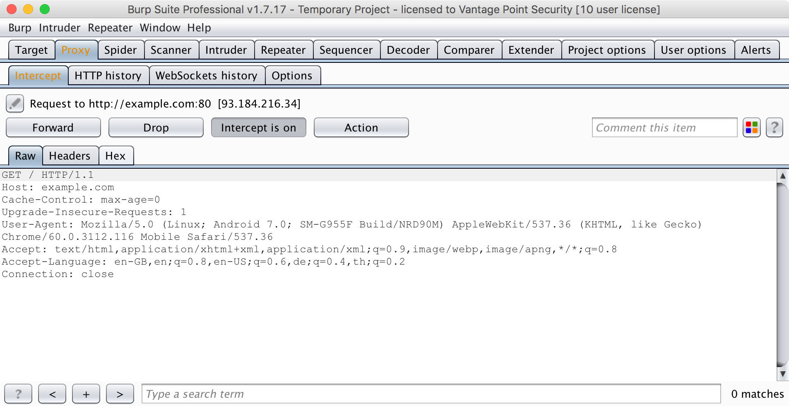

## Testing Network Communication

ネットワークに接続されたすべてのモバイルアプリケーションは、HTTP(Hypertext Transfer Protocol)またはTLS(Transport Layer Security)経由のHTTPSを使用して、リモートエンドポイントとの間でデータを送受信します。その結果、ネットワーク・ベースの攻撃(パケット・スニッフィングや中間者攻撃)が問題になります。 この章では、モバイルアプリとエンドポイント間のネットワーク通信に関する潜在的な脆弱性、テスト手法、およびベストプラクティスについて説明します。

### Intercepting HTTP(S) Traffic

多くの場合、HTTP(S)トラフィックがホストマシン上で実行されている *中間プロキシ* 経由でリダイレクトされるように、モバイルデバイスにシステムプロキシを設定するのが最も実用的です。モバイルアプリクライアントとバックエンドの間のリクエストを監視することにより、利用可能なサーバーサイドAPIを簡単にマッピングし、通信プロトコルを理解することができます。さらに、サーバー側のバグをテストするためのリクエストを再生して操作することもできます。

無料の商用プロキシツールがいくつか用意されています。最も人気のあるものは次のとおりです。

- [Burp Suite](https://portswigger.net/burp)
- [OWASP ZAP](https://www.owasp.org/index.php/OWASP_Zed_Attack_Proxy_Project)
- [Charles Proxy](https://www.charlesproxy.com)

中間プロキシを使用するにはPC/MACで実行し、HTTP(S)リクエストをプロキシにルーティングするようにモバイルアプリを設定する必要があります。ほとんどの場合、モバイルデバイスのネットワーク設定でシステム全体のプロキシを設定するだけで十分です。標準のHTTP APIや `okhttp` などの一般的なライブラリを使用する場合は、自動的にシステム設定が使用されます。

プロキシを使用するとSSL証明書の検証が中断され、通常はTLS接続を開始できません。この問題を回避するには、プロキシのCA証明書をデバイスにインストールします。 OS固有の「Basic Security Testing」の章でこれを行う方法について説明します。



### Intercepting Traffic on the Network Layer

中間プロキシを使用した動的分析は、標準ライブラリがアプリケーションで使用され、すべての通信がHTTP経由で行われる場合は簡単です。しかし、これは動作していないいくつかのケースがあります：

- システムプロキシ設定を無視す[Xamarin](https://www.xamarin.com/platform "Xamarin")などのモバイルアプリケーション開発プラットフォームが使用されている場合。
- モバイルアプリケーションが、システムプロキシの使用状況を確認し、プロキシを介したリクエストの送信を拒む場合。
- AndroidのGCM / FCMなどのプッシュ通知を傍受したい場合。
- XMPPまたは他の非HTTPプロトコルが使用されている場合。

このような場合は、まず何をすべきかを決めるためにネットワークトラフィックを監視して分析する必要があります。幸いにも、ネットワーク通信のリダイレクトと傍受のためのいくつかの方法があります：

- トラフィックをホストマシンに向けてルーティングします。使用しているオペレーティングシステムに内蔵されたインターネット共有機能などを用いることで、Mac / PCをネットワークゲートウェイとして設定することができます。。その後、[Wireshark](https://www.wireshark.org)を使用して、モバイルデバイスからインターネットに接続されているすべてのトラフィックを傍受することができます。

- [ettercap](https://ettercap.github.io/ettercap/ "Ettercap")を使用して、モバイルデバイスからホストマシンへのネットワークトラフィックをリダイレクトします（下記参照）。

- ルート化した端末では、フッキングやコードインジェクションを使用してネットワーク関連のAPI呼び出し(HTTPリクエストなど)を傍受し、これらの呼び出しの引数をダンプしたり操作したりすることができます。これにより、実際のネットワークデータを検査する必要がなくなります。これらのテクニックについては、「Reverse Engineering and Tampering」の章で詳しく説明します。

- iOSでは、代わりに"リモート仮想インターフェイス"を作成するという方法があります。この方法については、「Basic Security Testing on iOS」の章で説明します。

#### Simulating a Man-in-the-Middle Attack

[Ettercap](https://ettercap.github.io/ettercap/ "Ettercap")は、中間者攻撃をシミュレートするためにネットワーク侵入テスト中に使用できます。これは、 [ARPポイズニング攻撃やARPスプーフィング攻撃](https://en.wikipedia.org/wiki/ARP_spoofing "ARP poisoning/spoofing")をターゲットマシンに実行することで実現します。このような攻撃が成功すると、2台のマシン間のすべてのパケットは、中間者の役割を果たす第3のマシンにリダイレクトされ、分析のためにトラフィックをインターセプトできます。

モバイルアプリの完全な動的分析を行うには、すべてのネットワークトラフィックをインターセプトする必要があります。メッセージを傍受するには、準備のためにいくつかの手順を検討する必要があります。

**Ettercapのインストール**

Ettercapはすべての主要なLinuxおよびUnix系列のOSで利用可能で、それぞれのパッケージインストールメカニズムの一部になっています。MITMとして動作するマシンにインストールする必要があります。macOSでは、brewを使用してインストールできます。

```shell
$ brew install ettercap
```

Ettercapは、DebianベースのLinuxディストリビューションでは`apt-get`を用いてインストールすることもできます。

```shell
sudo apt-get install zlib1g zlib1g-dev
sudo apt-get install build-essential
sudo apt-get install ettercap
```

**ネットワーク分析ツール**

マシンにリダイレクトされるネットワークトラフィックを監視および分析できるツールをインストールします。最も一般的な2つのネットワーク監視(またはキャプチャ)ツールは次のとおりです。

- [Wireshark](https://www.wireshark.org "Wireshark") (CLI pendant: [tshark](https://www.wireshark.org/docs/man-pages/tshark.html "TShark")) and
- [tcpdump](https://www.tcpdump.org/tcpdump_man.html "tcpdump")

WiresharkはGUIを提供しており、コマンドラインに慣れていない方にはこちらが便利です。コマンドラインツールをお探しの場合は、TSharkまたはtcpdumpを使用する必要があります。これらのツールは、すべての主要なLinuxおよびUnix系列のOSで使用でき、それぞれのパッケージインストールメカニズムの一部になっています。

**ネットワークセットアップ**

MITMのポジションを得るには、モバイル端末とゲートウェイが通信するのと同じワイヤレスネットワーク上にマシンを置く必要があります。これが完了したら、以下の情報が必要が更に必要になります。

- モバイル端末のIPアドレス
- ゲートウェイのIPアドレス

#### ARP Poisoning with Ettercap

以下のコマンドでettercapを起動します。最初のIPアドレスは、ワイヤレスネットワークのネットワークゲートウェイのものに、2番目のIPアドレスはモバイル端末のものに置き換えます。

```shell
$ sudo ettercap -T -i en0 -M arp:remote /192.168.0.1// /192.168.0.105//
```

モバイル端末でブラウザを起動してexample.comに移動すると、次のような出力が表示されます。

```shell
ettercap 0.8.2 copyright 2001-2015 Ettercap Development Team

Listening on:
   en0 -> AC:BC:32:81:45:05
	  192.168.0.105/255.255.255.0
	  fe80::c2a:e80c:5108:f4d3/64

SSL dissection needs a valid 'redir_command_on' script in the etter.conf file
Privileges dropped to EUID 65534 EGID 65534...

  33 plugins
  42 protocol dissectors
  57 ports monitored
20388 mac vendor fingerprint
1766 tcp OS fingerprint
2182 known services

Scanning for merged targets (2 hosts)...

* |=========================================>| 100.00 %

2 hosts added to the hosts list...

ARP poisoning victims:

 GROUP 1 : 192.168.0.1 F8:E9:03:C7:D5:10

 GROUP 2 : 192.168.0.102 20:82:C0:DE:8F:09
Starting Unified sniffing...

Text only Interface activated...
Hit 'h' for inline help

Sun Jul  9 22:23:05 2017 [855399]
  :::0 --> ff02::1:ff11:998b:0 | SFR (0)


Sun Jul  9 22:23:10 2017 [736653]
TCP  172.217.26.78:443 --> 192.168.0.102:34127 | R (0)

Sun Jul  9 22:23:10 2017 [737483]
TCP  74.125.68.95:443 --> 192.168.0.102:35354 | R (0)
```

その結果、モバイル端末にて送受信される完全なネットワークトラフィックを確認できるようになりました。これには、DNS、DHCP、および他の形式の通信も含まれているため、非常に「ノイズが多い」可能性があります。したがって、関連するトラフィックのみに集中できるよう、[DisplayFilters in Wireshark](https://wiki.wireshark.org/DisplayFilters "DisplayFilters")の使い方や[tcpdumpのフィルタリング方法](https://danielmiessler.com/study/tcpdump/#gs.OVQjKbk "A tcpdump Tutorial and Primer with Examples")などを知る必要があります。の使い方を知っているはずです。

> ARPスプーフィング攻撃を通じてOSI参照モデルのレイヤ2で実行されるため、中間者による攻撃はどのデバイスやオペレーティングシステムに対しても機能します。あなたが中間者である場合、TLSを使用して暗号化される可能性があるため、平文データを見ることができないかもしれませんが、使用されるプロトコル、およびアプリケーションが通信しているポートなどのホストに関わる重要なデータを与えてくれます。

例として、次のセクションでXamarinアプリからのすべてのリクエストを中間プロキシにリダイレクトします。

#### Span Port / Port Forwarding

ettercapによるMITM攻撃の代わりに、Wifiアクセスポイント(AP)やルータを代わりに使用することもできます。設定にはAPの設定にアクセスする必要があります。これはエンゲージメントする前に明確にする必要があります。再構成が可能な場合は、まずAPが次のいずれかをサポートしているかどうかを確認する必要があります。

- ポート転送機能または
- スパンまたはミラーポートの機能

どちらのシナリオでも、APはあなたのマシンのIPアドレスを指すように設定する必要があります。その後、Wiresharkのようなツールを使用して、トラフィックを監視し記録することができます。

#### Setting a Proxy Through Runtime Instrumentation

ルート化端末またはjailbreakした端末では、ランタイムフックを使用して新しいプロキシを設定したり、ネットワークトラフィックをリダイレクトすることもできます。これは[Inspeckage](https://github.com/ac-pm/Inspeckage)や、[frida](https://www.frida.re)や[cycript](http://www.cycript.org)のようなコードインジェクションフレームワークのようなフックツールで実現できます。このガイドの「Reverse Engineering and Tampering」の章で、ランタイムインスツルメンテーションに関する詳細を参照できます。

#### Example: Dealing with Xamarin

Xamarinは、Visual StudioとC#を用いて、[native Android](https://developer.xamarin.com/guides/android/getting_started/ "Getting Started with Android") と [iOS apps](https://developer.xamarin.com/guides/ios/ "Getting Started with iOS")を作成できるモバイルアプリケーション開発プラットフォームです。

Xamarinアプリケーションをテストするときに、WiFi設定でシステムプロキシを設定しようとすると、Xamarinによって作成されたアプリケーションがあなたの端末のローカルプロキシ設定を使用しないため、中間プロキシでHTTPリクエストを見ることができなくなります。これを解決する方法は2つあります。

- `OnCreate()`メソッドか`Main()`メソッドに次のコードを追加してアプリを再生成することで、[アプリケーションのデフォルトプロキシ](https://developer.xamarin.com/api/type/System.Net.WebProxy/ "System.Net.WebProxy Class")に追加します。

```
WebRequest.DefaultWebProxy = new WebProxy("192.168.11.1", 8080);
```

- MITM(man-in-the-middle)のpositionを取得するにはettercapを使用してください。詳しくは上述のMITM攻撃の設定方法に関するセクションを参照してください。MITMになるには、ポート443の通信をlocalhost上で動作する中間プロキシにリダイレクトすればOKです。これは、macOSで `rdr`コマンドを使うことでできます：

```shell
$ echo "
rdr pass inet proto tcp from any to any port 443 -> 127.0.0.1 port 8080
" | sudo pfctl -ef -
```

中間プロキシは、上記のポート転送ルールで指定されたポート(8080)をリッスンする必要があります。

**CA証明書**

まだの場合は、モバイルデバイスにCA証明書をインストールして、HTTPSリクエストを傍受することができます。

- [中間プロキシのCA証明書をあなたのAndroid端末にインストールする](https://support.portswigger.net/customer/portal/articles/1841102-installing-burp-s-ca-certificate-in-an-android-device "Installing Burp's CA Certificate in an Android Device")
- [あなたの中間プロキシのCA証明書をiOS端末にインストールする](https://support.portswigger.net/customer/portal/articles/1841108-configuring-an-ios-device-to-work-with-burp "Configuring an iOS Device to Work With Burp")

**通信を傍受する**

アプリの使用を開始し、その機能を起動します。中間プロキシにHTTPメッセージが表示されるはずです。

> ettercapを使用する場合は、[Proxy]-[Options]-[Edit]で[Support invisible proxying]を有効にする必要があります。


### Verifying Data Encryption on the Network

#### Overview

コアモバイルアプリ機能の1つは、インターネットなどの信頼できないネットワークを介してデータを送受信することです。データが、その通信中に適切に保護されていない場合、ネットワークインフラの任意の部分(Wi-Fiアクセスポイントなど)にアクセスできる攻撃者は、そのデータをトラップし、読み取り、または変更する可能性があります。 これが、平文なネットワークプロトコルが推奨されない理由です。

大部分のアプリケーションは、バックエンドとの通信をHTTPで行っています。HTTPSは暗号化された接続でHTTPをラップします(HTTPSは"HTTP over Secure Socket Layer(SSL)"の頭文字になります。SSLはTLSの前身で、廃止予定となっています)。TLSは、バックエンドサービスの認証を可能にし、ネットワークデータの機密性と完全性を保証します。

##### Recommended TLS Settings

サーバー側で適切なTLS構成を確保することも重要です。SSLは廃止予定であり、今後は使用しないでください。TLS v1.2とv1.3は安全だと考えられていますが、多くのサービスではでは古いクライアントとの互換性のために未だにTLS v1.0とv1.1を有効にしています。

クライアントとサーバーの両方が同じ組織によって制御され、相互に通信するためだけに使用される場合、[hardening the configuration](https://dev.ssllabs.com/projects/best-practices/ "Qualys SSL/TLS Deployment Best Practices")によってセキュリティを更に強化することができます。

モバイルアプリケーションが特定のサーバーに接続している場合、そのネットワークスタックをチューニングして、サーバーの構成に対して可能な限り高いセキュリティレベルを確保することができます。基盤となるオペレーティングシステムでのサポートの欠如は、モバイルアプリケーションがより弱い構成を使用するように強制する可能性があります。

たとえば、一般的なAndroidネットワーキングライブラリokhttpは、以下の推奨される暗号スイートセットを使用しますが、Androidバージョン7.0以降でのみ使用できます。

- `TLS_ECDHE_ECDSA_WITH_AES_128_GCM_SHA256`
- `TLS_ECDHE_RSA_WITH_AES_128_GCM_SHA256`
- `TLS_ECDHE_ECDSA_WITH_AES_256_GCM_SHA384`
- `TLS_ECDHE_RSA_WITH_AES_256_GCM_SHA384`
- `TLS_ECDHE_ECDSA_WITH_CHACHA20_POLY1305_SHA256`
- `TLS_ECDHE_RSA_WITH_CHACHA20_POLY1305_SHA256`

以前のバージョンのAndroidをサポートするためには、`TLS_RSA_WITH_3DES_EDE_CBC_SHA`のように安全性が低いと考えられるいくつかの暗号を追加します。

同様に、iOS ATS(App Transport Security)の設定には、次のいずれかの暗号が必要です。

- `TLS_ECDHE_ECDSA_WITH_AES_256_GCM_SHA384`
- `TLS_ECDHE_ECDSA_WITH_AES_128_GCM_SHA256`
- `TLS_ECDHE_ECDSA_WITH_AES_256_CBC_SHA384`
- `TLS_ECDHE_ECDSA_WITH_AES_256_CBC_SHA`
- `TLS_ECDHE_ECDSA_WITH_AES_128_CBC_SHA256`
- `TLS_ECDHE_ECDSA_WITH_AES_128_CBC_SHA`
- `TLS_ECDHE_RSA_WITH_AES_256_GCM_SHA384`
- `TLS_ECDHE_RSA_WITH_AES_128_GCM_SHA256`
- `TLS_ECDHE_RSA_WITH_AES_256_CBC_SHA384`
- `TLS_ECDHE_RSA_WITH_AES_128_CBC_SHA256`
- `TLS_ECDHE_RSA_WITH_AES_128_CBC_SHA`

#### Static Analysis

ソースコード内のすべてのAPI/Webサービスのリクエストを特定し、平文のHTTPなURLがリクエストされていないことを確認します。また、[HttpsURLConnection](https://developer.android.com/reference/javax/net/ssl/HttpsURLConnection.html "HttpsURLConnection")や[SSLSocket](https://developer.android.com/reference/javax/net/ssl/SSLSocket.html "SSLSocket") (TLSを使用したソケットレベルの通信用)を用いて機密情報が安全なチャネルを介して送信されていることを確認します。

`SSLSocket`はホスト名を検証 **しない** ことに注意してください。`getDefaultHostnameVerifier`を使ってホスト名を確認するようにしてください。Android開発者向けドキュメントには、[コード例](https://developer.android.com/training/articles/security-ssl.html#WarningsSslSocket "Warnings About Using SSLSocket Directly")が含まれています。

ベストプラクティスに従ってサーバーが構成されていることを確認します。[OWASP Transport Layer Protection cheat sheet](https://www.owasp.org/index.php/Transport_Layer_Protection_Cheat_Sheet "Transport Layer Protection Cheat Sheet") と [Qualys SSL/TLS Deployment Best Practices](https://dev.ssllabs.com/projects/best-practices/ "Qualys SSL/TLS Deployment Best Practices")を参照してください。

静的解析には、HTTPS接続が終了するWebサーバーまたはリバースプロキシの構成ファイルが必要です。 [OWASP Transport Layer Protection cheat sheet](https://www.owasp.org/index.php/Transport_Layer_Protection_Cheat_Sheet "Transport Layer Protection Cheat Sheet") と [Qualys SSL/TLS Deployment Best Practices](https://dev.ssllabs.com/projects/best-practices/ "Qualys SSL/TLS Deployment Best Practices")を参照してください。

#### Dynamic Analysis

テストされたアプリの受信および送信のネットワークトラフィックをトラップし、このトラフィックが暗号化されていることを確認します。次のいずれかの方法でネットワークトラフィックを確認することができます。

- [OWASP ZAP](https://security.secure.force.com/security/tools/webapp/zapandroidsetup "OWASP ZAP") や [Burp Suite Professional](https://support.portswigger.net/customer/portal/articles/1841101-configuring-an-android-device-to-work-with-burp "Configuring an Android device to work with Burp")といった中間プロキシを用いてすべてのHTTPおよびWebsocketの通信を取得し、すべてのリクエストがHTTPではなくHTTPS経由で行われていることを確認します。

BurpやOWASP ZAPのような中間プロキシは、HTTPの通信しか表示できません。しかし、[Burp-non-HTTP-Extension](https://github.com/summitt/Burp-Non-HTTP-Extension) や [mitm-relay](https://github.com/jrmdev/mitm_relay)といったBurpプラグインを利用することで、XMPPやそれ以外のプロトコルの通信をデコードし、視覚化することができます。

>一部のアプリケーションでは、証明書のピンニング機能によってBurpやZAPなどのプロキシでは動作しないことがあります。このような場合は、"Testing Custom Certificate Stores and SSL Pinning"を参照してください。Vproxyのようなツールを使用すると、すべてのHTTP(S)トラフィックをマシンにリダイレクトし、暗号化されていないリクエストに対して盗聴や調査を行うことができます。

### Making Sure that Critical Operations Use Secure Communication Channels

#### Overview

[OWASP MASVS](https://github.com/OWASP/owasp-masvs/blob/master/Document/0x03-Using_the_MASVS.md "The Mobile Application Security Verification Standard")は銀行アプリケーションのような機密性の高いアプリケーションの場合、「徹底的な防御」検証レベルを導入しています。そのようなアプリケーションの重要な操作(例えば、ユーザ登録およびアカウント回復)は、攻撃者にとって最も魅力的なターゲットである。これには、ユーザー操作を確認するための追加チャネル(SMSや電子メールなど)などの高度なセキュリティ制御の実装が必要となります。

#### Static Analysis

コードを確認し、重要な操作を参照する部分を特定します。そのような操作に追加のチャンネルが使用されていることを確認してください。追加の確認チャンネルの例を次に示します。

- トークン(RSAトークン、yubikeyなど)
- プッシュ通知（Googleプロンプトなど）
- SMS
- Eメール
- あなたが訪問した、またはスキャンした別のウェブサイトからのデータ
- 物理的な文字または物理的なエントリポイントからのデータ(銀行で書類に署名した後にのみ受け取るデータなど）

#### Dynamic Analysis

テストされたアプリケーションの重要な操作(ユーザーの登録、アカウントの回復、送金など)をすべて特定します。各重要な操作に少なくとも1つの追加チャンネル(SMS、Eメール、トークンなど)が必要であることを確認します。関数を直接呼び出すと、これらのチャネルの使用をバイパスできたりしないか確認してください。

#### Remediation

重要な操作を行う際は、少なくとも1つの追加チャネルの使用が強制されているか確認してください。重要な操作を実行するときに、これらのチャネルがバイパスできてはいけません。ユーザーの身元を確認するための追加要素を実装する場合は、[Infobip 2FA library](https://2-fa.github.io/libraries/android-library.html "Infobip 2FA library")または [Google Authenticator](https://github.com/google/google-authenticator-android "Google Authenticator for Android")などのワンタイムパスワードの導入を検討してください。

### References

#### OWASP Mobile Top 10 2016
- M3 - Insecure Communication - https://www.owasp.org/index.php/Mobile_Top_10_2016-M3-Insecure_Communication

#### OWASP MASVS
- V5.1: "Data is encrypted on the network with TLS. The secure channel is used consistently throughout the app."
- V5.5: "The app doesn't rely on a single insecure communication channel (e-mail or SMS) for critical operations such as enrollment and account recovery."

#### CWE
- CWE-308 - Use of Single-factor Authentication
- CWE-319 - Cleartext Transmission of Sensitive Information

#### Tools

- Tcpdump - https://www.androidtcpdump.com/
- Wireshark - https://www.wireshark.org/
- OWASP ZAP - https://www.owasp.org/index.php/OWASP_Zed_Attack_Proxy_Project
- Burp Suite - https://portswigger.net/burp/
- Vproxy - https://github.com/B4rD4k/Vproxy
