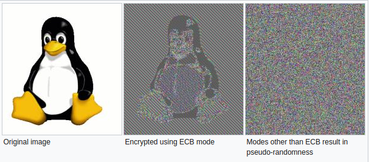

## Cryptography for Mobile Apps

暗号化は、ユーザーのデータを安全に保つために特に重要な役割を果たします。モバイル環境では、ユーザーのデバイスへの物理的なアクセスを持つ攻撃者が想定されるシナリオになります。この章では、モバイルアプリケーションに関連する暗号概念とベストプラクティスの概要について説明します。これらのベストプラクティスは、モバイルオペレーティングシステムとは独立して有効です。

### Key Concepts

暗号化の目的は、仮に攻撃に直面していたとしても、依然として機密性、完全性、信頼性を常に提供し続けるということにあります。機密性とは、暗号化を使用してデータのプライバシーを確​​保することです。データの完全性は、データの一貫性と、データが改ざん変更を検知できるということを意味します。信頼性は、データが信頼できるソースから得られることを保証します。

暗号化アルゴリズムは、平文データを元のコンテンツを隠す暗号テキストに変換します。平文データは暗号文から復元することができます。暗号化は **対称**(秘密鍵暗号化)または **非対称**(公開鍵暗号化)の２つに分けることができます。一般に、暗号化操作は完全性を保護しませんが、一部の対称暗号化モードではその保護が機能します。

**対称鍵暗号アルゴリズム** は、暗号化と復号の両方に同じ鍵を使用します。このタイプの暗号化は高速であり、バルクデータ処理に適しています。鍵にアクセスするすべての人が暗号化されたコンテンツを復号できるので、この方法では慎重な鍵管理が必要です。**公開鍵暗号化アルゴリズム** は、公開鍵と秘密鍵の2つの異なる鍵で動作します。公開鍵は自由に配布できますが、秘密鍵は誰とも共有しないでください。公開鍵で暗号化されたメッセージは、秘密鍵でのみ解読できます。非対称暗号化は対称操作よりも数倍遅いため、通常はバルク暗号化のための対称鍵などの少量のデータを暗号化するためにのみ使用されます。

**Hashing** は暗号化の形式ではありませんが、暗号化を使用します。ハッシュ関数は、任意のデータを固定長の値にマップします。入力値からハッシュを計算するのは簡単ですが、ハッシュから元の入力値を解析することは非常に困難です(つまり、実行不可能です)。ハッシュ関数は完全性の検証に使用されますが、真正性保証を提供しません。

**メッセージ認証コード**(MAC)は、他の暗号化メカニズム(対称暗号化またはハッシュなど)を秘密鍵と組み合わせて、完全性保護と信頼性保護の両方を提供します。しかしながら、MACを検証するために、複数のエンティティが同じ秘密鍵を共有しなければならず、それらのエンティティのいずれかが有効なMACを生成することができます。最も一般的に使用されるタイプのMACであるHMACは、基本的な暗号プリミティブとしてハッシングに依存します。HMACアルゴリズムの完全な名前には、通常、もととなるハッシュ関数の型が含まれますたとえば、(HMAC-SHA256はSHA-256ハッシュ関数を使用します)。

**Signatures** は、秘密鍵でメッセージのハッシュを暗号化することによって、整合性と信頼性を提供するためにハッシュを使用する非対称暗号化(つまり、公開鍵/秘密鍵ペアを使用)を組み合わせて利用します。しかし、MACとは異なり、秘密鍵はデータ署名者に固有のままでなければならないため、署名は否認防止プロパティも提供します。

**キー導出関数**（KDFs）は、秘密の値(パスワードなど)から秘密鍵を派生させ、鍵を他の形式に変換したり長さを増やしたりするために使用されます。KDFはハッシュ関数に似ていますが、他の用途もあります(たとえば、複数のパーティーのキーアグリーメントプロトコルのコンポーネントとして使用されています)。KDFは、ハッシュ関数とKDFの両方を逆にすることは困難ですが、生成するキーにはランダム性が必要であるという要件が追加されています。

### Identifying Insecure and/or Deprecated Cryptographic Algorithms

モバイルアプリを評価する際には、既知の弱点があったり、最新のセキュリティ要件には不十分であったりするような暗号アルゴリズムやプロトコルを使用していないかを確認する必要があります。過去に安全であると考えられていたアルゴリズムも、時間経過で安全性が低下していきます。したがって、現在のベストプラクティスを定期的に確認し、それに応じて構成を調整することが重要です。

暗号アルゴリズムが最新になっており、業界標準に適合しているかを確認してください。脆弱なアルゴリズムには、旧式のブロック暗号(DESなど)、ストリーム暗号(RC4など)、ハッシュ関数(MD5など)、乱数発生器(Dual_EC_DRBGなど)などがあります。認定されているアルゴリズム(NISTなどによって)でさえ、時間が経つにつれて安全性が損なわれる可能性があることに注意してください。認定は、アルゴリズムの健全性の定期的な検証に取って代わるものではありません。既知の弱点を持つアルゴリズムは、より安全な代替手段に置き換えてください。

アプリケーションのソースコードを調べて、次のような弱い暗号アルゴリズムのインスタンスを特定します。

- [DES, 3DES](https://www.enisa.europa.eu/publications/algorithms-key-size-and-parameters-report-2014 "ENISA Algorithms, key size and parameters report 2014")
- RC2
- RC4
- [BLOWFISH](https://www.enisa.europa.eu/publications/algorithms-key-size-and-parameters-report-2014 "ENISA Algorithms, key size and parameters report 2014")
- MD4
- MD5
- SHA1

暗号化APIの名前は、特定のモバイルプラットフォームによって異なります。

- 暗号アルゴリズムは、最新化され業界標準に適合しています。こういう表現をしていたとしても、デッドブロック暗号(DESなど)、ストリーム暗号(RC4など)、ハッシュ関数(MD5など)、Dual_EC_DRBGなどの脆弱な乱数生成器などが含まれています(NIST認定であっても)。これらはすべて安全でないとマークされ、アプリケーションとサーバーからにおける使用を避け、削除すべきとされています。
- キーの長さは業界標準と一致し、十分な時間を保護します。ムーアの法則を考慮して、さまざまな鍵の長さと保護を比較することは、[オンライン](https://www.keylength.com/ "Keylength comparison")で可能です。
- 暗号パラメータは、妥当な範囲内で明確に定義されています。これには以下が含まれますが、これに限定されるというものではありません。少なくともハッシュ関数の出力と同じ長さでなければならない暗号化のソルト、パスワード導出関数と反復回数の合理的な選択(例えばPBKDF2、scryptまたはbcrypt)、ランダムでユニークなIV、目的に応じたブロック暗号化モード(例えば、特定のケースを除いて、ECBを使用すべきではない)、適切なキー管理(例えば、3DESは3つの独立したキーを持つべきである)など。

次のアルゴリズムを推奨します。

- 機密性アルゴリズム：AES-GCM-256またはChaCha20-Poly1305
- 整合性アルゴリズム：SHA-256、SHA-384、SHA-512、Blake2
- デジタル署名アルゴリズム：RSA(3072ビット以上)、ECDSA、NIST P-384
- キー設定アルゴリズム：RSA(3072ビット以上)、(DH3072ビット以上)、NIST P-384を使用したECDH

さらに、暗号化キーの格納、暗号化操作の実行などのために、常にセキュリティハードウェア(使用可能な場合)を利用する必要があります。

アルゴリズムの選択とベストプラクティスの詳細については、次のリソースを参照してください。
- ["Commercial National Security Algorithm Suite and Quantum Computing FAQ"](https://cryptome.org/2016/01/CNSA-Suite-and-Quantum-Computing-FAQ.pdf "Commercial National Security Algorithm Suite and Quantum Computing FAQ")
- [NIST recommendations (2016)](https://www.keylength.com/en/4/ "NIST recommendations")
- [BSI recommendations (2017)](https://www.keylength.com/en/8/ "BSI recommendations")

### Common Configuration Issues

#### Insufficient Key Length

最も安全な暗号化アルゴリズムであっても、そのアルゴリズムが不十分な鍵サイズである場合、ブルートフォース攻撃に対して脆弱になります。

キーの長さが[accepted industry standards](https://www.enisa.europa.eu/publications/algorithms-key-size-and-parameters-report-2014 "ENISA Algorithms, key size and parameters report 2014")を満たしていることを確認してください。

#### Symmetric Encryption with Hard-Coded Cryptographic Keys

対称暗号化と鍵付きハッシュ(MAC)のセキュリティは、鍵の秘密性に依存します。鍵が開示されていると、暗号化によって得られたセキュリティは失われます。これを防ぐには、作成した暗号化データと同じ場所に秘密鍵を保存しないようにしてください。開発者が、静的でハードコードされた暗号化キーを使用してローカルに保存されたデータを暗号化し、そのキーをアプリケーションにコンパイルするのは間違いです。これを行うと、逆アセンブラできるすべての人がキーにアクセスできるようになります。

まず、ソースコード内にキーやパスワードが格納されていないことを確認します。たとえソースコードが難読化されていても、難読化は動的インスツルメンテーションによって簡単にバイパスされるため、ハードコードされたキーは問題があることに注意してください。

アプリが双方向SSL(サーバー証明書とクライアント証明書の両方を検証済み)を使用している場合は、次の点を確認してください。

    1. クライアント証明書のパスワードがローカルに保存されていないか、デバイスのキーチェーンにロックされていること。
    2. クライアント証明書がすべてのインストールで共有されていないこと。

アプリがアプリデータに格納されている追加の暗号化コンテナに依存している場合は、暗号化キーがどのように利用されるかを確認してください。キーラッピングスキームが利用されている場合、マスターシークレットが各ユーザー用に初期化されているか、コンテナが新しいキーで再暗号化されていることを確認してください。マスターシークレットまたは以前のパスワードを使用してコンテナを復号化できる場合は、パスワードの変更の処理方法を確認してください。

秘密鍵は、モバイルアプリで対称暗号が使用されるときは常に、安全なデバイスストレージに保存する必要があります。プラットフォーム固有のAPIの詳細については、[**Testing Data Storage on Android**](https://github.com/OWASP/owasp-mstg/blob/master/Document/0x05d-Testing-Data-Storage.md) と [**Testing Data Storage on iOS**](https://github.com/OWASP/owasp-mstg/blob/master/Document/0x06d-Testing-Data-Storage.md)の章を参照してください。

#### Weak Key Generation Functions

暗号アルゴリズム(対称暗号化や一部のMACなど)では、所定のサイズの秘密の値の入力が必要です。たとえば、AESは正確に16バイトのキーを使用します。ネイティブ実装では、ユーザが入力したパスワードを入力キーとして直接使用することがあります。ユーザが入力したパスワードを入力キーとして使用すると、次の問題が発生します。

- パスワードがキーよりも小さい場合、キースペースのすべては使用されなくなります。残りのスペースはパディングされます(スペースはパディングに使用されることがあります)。
- ユーザーが入力したパスワードは、現実的には、表示可能で発音可能な文字でほとんど構成されます。したがって、利用可能な256のASCII文字のうちのいくつかのみが使用され、エントロピーは約4分の1に減少することになります。

パスワードが暗号化機能に直接渡されないようにしてください。代わりに、ユーザーが入力したパスワードは、暗号鍵を作成するためにKDFに渡す必要があります。パスワード導出関数を使用する場合は、適切な反復回数を選択します。例えば、[NIST recommends and iteration count of at least 10,000 for PBKDF2](https://pages.nist.gov/800-63-3/sp800-63b.html#sec5 "NIST Special Publication 800-63B")などを参照してみてください。

#### Weak Random Number Generators

どんなデバイスであっても真なる乱数を生成することは基本的に不可能です。擬似乱数ジェネレータ(RNG)は、擬似乱数ストリーム(ランダムに生成された *かのように見える* 一連の数字)を生成することでこれを補います。生成される数値の品質は、使用されるアルゴリズムのタイプによって異なります。*Cryptographically secure* RNGは統計的ランダム性テストをパスする乱数を生成し、予測攻撃に対して弾力性があります。

モバイルSDKは、十分な人工ランダム性を持つ数を生成するRNGアルゴリズムの標準実装を提供します。 利用可能なAPIについては、AndroidおよびiOS固有のセクションで紹介します。

#### Custom Implementations of Cryptography

独自の暗号機能を発明することは、時間がかかり、困難であり、失敗する可能性が高いです。その代わりに、広く安全とみなされるよく知られたアルゴリズムを使用することができます。モバイルオペレーティングシステムは、これらのアルゴリズムを実装する標準の暗号APIを提供します。

ソースコード内で使用されているすべての暗号方法、特に機密データに直接適用される暗号方法を慎重に検査してください。すべての暗号操作では、AndroidおよびiOS用の標準暗号APIを使用する必要があります(プラットフォーム固有の章で詳しく説明します)。既知のプロバイダから標準ルーチンを呼び出さない暗号操作は、厳密に検査する必要があります。変更された標準アルゴリズムに細心の注意を払ってください。エンコーディングは暗号化と同じではないことを忘れないでください!XOR(排他的論理和)のようなビット操作演算子を見つけた場合、さらに深く調べるようにしてください。

#### Inadequate AES Configuration

Advanced Encryption Standard(AES)は、モバイルアプリの対称暗号化のために広く受け入れられている標準です。これは一連のリンクされた数学演算に基づく反復ブロック暗号です。AESは入力に対して可変数のラウンドを実行します。各ラウンドには、入力ブロック内のバイトの置換と置換が含まれます。各ラウンドは元のAESキーから派生した128ビットラウンド鍵を使用します。

この執筆時点では、AESに対する効率的な暗号解読攻撃は発見されていません。ただし、実装の詳細およびブロック暗号モードなどの設定可能なパラメータには、ある程度の誤差があります。

##### Weak Block Cipher Mode

ブロックベース暗号化は、離散入力ブロック(例えば、AESは128ビットブロックを有する)に対して実行されます。平文がブロックサイズより大きい場合、平文は内部的に与えられた入力サイズのブロックに分割され、各ブロックで暗号化が実行されます。ブロック暗号動作モード(またはブロックモード)は、前のブロックを暗号化した結果が後続のブロックに影響を与えるかどうかを決定します。

[ECB (Electronic Codebook)](https://en.wikipedia.org/wiki/Block_cipher_mode_of_operation#Electronic_Codebook_.28ECB.29 "Electronic Codebook (ECB)") は入力された値を固定サイズのブロックに分割し、それらを同じキーを使用して別々に暗号化します。複数の分割ブロックに同じ平文が含まれている場合、それらは同じ暗号文ブロックに暗号化され、データ内のパターンを識別しやすくします。状況によっては、攻撃者が暗号化されたデータを再現できる可能性もあります。

ECBの代わりにCipher Block Chaining(CBC)モードが使用されていることを確認します。CBCモードでは、平文ブロックは前の暗号文ブロックとXORされます。これにより、ブロックに同じ情報が含まれていても、暗号化された各ブロックが一意にランダム化されます。

暗号化されたデータを格納する場合は、Galois/Counter Mode(GCM)など、格納されたデータの完全性を保護するブロックモードを使用することを推奨します。後者には、このアルゴリズムは各TLSv1.2実装に必須であり、したがって、現代のすべてのプラットフォームで利用可能であるという追加の利点があります。

効果的なブロックモードの詳細については、[NIST guidelines on block mode selection](https://csrc.nist.gov/groups/ST/toolkit/BCM/modes_development.html "NIST Modes Development, Proposed Modes")を参照してください。

##### Predictable Initialization Vector

CBCモードでは、最初の平文ブロックを初期化ベクトル(IV)と組み合わせる必要があります。IVは秘密にする必要はありませんが、予測可能であってはなりません。暗号的に安全な乱数ジェネレータを使用してIVが生成されていることを確認してください。IVの詳細については、[Crypto Fail's initialization vectors article](http://www.cryptofails.com/post/70059609995/crypto-noobs-1-initialization-vectors)を参照してください。

### Cryptographic APIs on Android and iOS

特定のOSに関係なく、同じ基本的な暗号化原則が適用されますが、各オペレーティングシステムは独自の実装とAPIを提供します。データストレージ用のプラットフォーム固有の暗号化APIについては、[**Testing Data Storage on Android**](https://github.com/OWASP/owasp-mstg/blob/master/Document/0x05d-Testing-Data-Storage.md) と [**Testing Data Storage on iOS**](https://github.com/OWASP/owasp-mstg/blob/master/Document/0x06d-Testing-Data-Storage.md)で詳しく説明しています。ネットワークトラフィック、特にTransport Layer Security（TLS）の暗号化については、[**Testing Network Communication**](https://github.com/OWASP/owasp-mstg/blob/master/Document/0x05g-Testing-Network-Communication.md)の章で説明しています。

#### References

##### OWASP Mobile Top 10

- M6 - Broken Cryptography

##### OWASP MASVS

- V3.1: "The app does not rely on symmetric cryptography with hardcoded keys as a sole method of encryption."
- V3.2: "The app uses proven implementations of cryptographic primitives."
- V3.3: "The app uses cryptographic primitives that are appropriate for the particular use-case, configured with parameters that adhere to industry best practices."
- V3.4: "The app does not use cryptographic protocols or algorithms that are widely considered depreciated for security purposes."

##### CWE

- CWE-326 - Inadequate Encryption Strength
- CWE-327 - Use of a Broken or Risky Cryptographic Algorithm
- CWE-329 - Not Using a Random IV with CBC Mode
