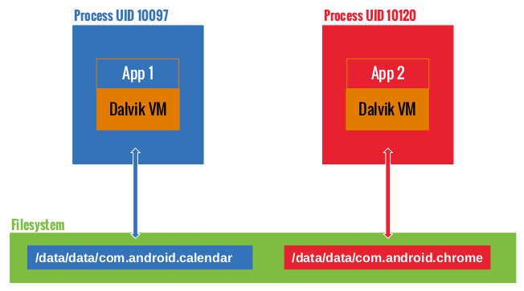
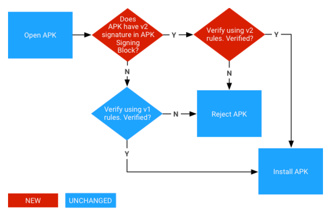

## Android Platform Overview

このセクションでは、アーキテクチャの観点からAndroidプラットフォームを紹介します。以下の5つの主要分野について説明します。

1. Androidセキュリティアーキテクチャ
2. Androidのアプリケーション構造
3. プロセス間通信（IPC）
4. Androidアプリケーションの公開
5. Androidアプリケーションの攻撃面

Androidプラットフォームの詳細については、公式の[Android developer documentation website](https://developer.android.com/index.html "Android Developer Guide")を参照してください。

### Android Security Architecture

Androidは、Googleがモバイルオペレーティングシステム(OS)として開発したLinuxベースのオープンソースプラットフォームです。今日のプラットフォームは、携帯電話、タブレット、ウェアラブルテック、テレビ、その他の"スマート"デバイスなど、さまざまな最新技術の基盤が存在します。典型的なAndroidは、プレインストールされた("ストック")アプリの範囲で出荷され、Google Playストアや他のマーケットプレースを通じてサードパーティのアプリのインストールをサポートします。

Androidのソフトウェアスタックは、いくつかの異なる層で構成されています。各層はインターフェイスを定義し、特定のサービスを提供します。


最も低レベルな箇所では、AndroidはLinuxカーネルのバリエーションに基づいています。カーネルにて、ハードウェア抽象化層(HAL)は組み込みハードウェアコンポーネントと相互作用するための標準インタフェースを定義します。いくつかのHALの実装は、必要に応じてAndroidシステムが呼び出す共有ライブラリモジュールにパッケージ化されています。これは、アプリケーションがデバイスのハードウェアとやり取りできるようにするための基盤です。たとえば、標準の電話アプリケーションでデバイスのマイクとスピーカーを使用することができます。

Androidアプリは通常Javaで書かれ、Dalvikバイトコードにコンパイルされています。これは従来のJavaバイトコードとは多少異なります。Dalvikバイトコードは、最初にJavaコードを.classファイルにコンパイルし、次に`dex`ツールを使ってJVMバイトコードをDalvik .dexフォーマットに変換することによって作成されます。


現在のバージョンのAndroidは、このバイトコードをAndroidランタイム(ART)で実行します。ARTは、Androidのオリジナルランタイム、Dalvik Virtual Machineの後継です。DalvikとARTの主な違いは、バイトコードの実行方法です。

Dalvikでは、バイトコードは実行時にマシンコードに変換されます。これは *JIT*(Just-In-Time)コンパイルとして知られています。JITコンパイルはパフォーマンスに悪影響を及ぼします。コンパイルはアプリが実行されるたびに実行する必要があります。パフォーマンスを向上させるために、ARTは *ahead-of-time*(AOT)コンパイルを導入しました。名前が示すように、アプリケーションは最初に実行される前にプリコンパイルされます。このプリコンパイル済みのマシンコードは、その後のすべての実行に使用されます。AOTは、消費電力を削減しながらパフォーマンスを2倍に向上させます。

Androidアプリはハードウェアリソースに直接アクセスすることはできず、各アプリは独自のサンドボックス内で実行されます。これにより、リソースやアプリを正確に制御できます。たとえば、クラッシュしたアプリがデバイスで実行されている他のアプリに影響を与えることはありません。同時に、Androidランタイムは、アプリに割り当てられるシステムリソースの最大数を制御し、1つのアプリが多すぎるリソースを独占することを防ぎます。

#### Android Users and Groups

AndroidオペレーティングシステムはLinuxをベースにしていますが、他のUnix系システムと同じ方法でユーザーアカウントを実装することはありません。Androidでは、サンドボックスアプリに対するLinuxカーネルのマルチユーザーサポートを実装します。いくつかの例外を除いて、各アプリは、他のアプリや他のオペレーティングシステムから効果的に分離された、別々のLinuxユーザーの下でのように動作します。

ファイル[system/core/include/private/android_filesystem_config.h](http://androidxref.com/7.1.1_r6/xref/system/core/include/private/android_filesystem_config.h)には、システムプロセスが割り当てられている定義済みのユーザとグループのリストが含まれています。他のアプリケーションのUID(ユーザーID)は、アプリがインストールされるタイミングでが追加されます。詳細については、Androidのサンドボックスに関するBin Chenの[blog post](https://pierrchen.blogspot.mk/2016/09/an-walk-through-of-android-uidgid-based.html "Bin Chen - AProgrammer Blog - Android Security: An Overview Of Application Sandbox")を参照してください。

たとえば、Android Nougatでは、次のシステムユーザーを定義しています。

```
    #define AID_ROOT             0  /* traditional unix root user */

    #define AID_SYSTEM        1000  /* system server */
	...
    #define AID_SHELL         2000  /* adb and debug shell user */
	...
    #define AID_APP          10000  /* first app user */
	...
```

### Android Application Structure

#### Communication with the Operating System

Androidアプリは、高レベルのJava APIを提供する抽象化層であるAndroid Frameworkを介してシステムサービスと対話します。これらのサービスの大部分は、通常のJavaメソッド呼び出しを介して呼び出され、バックグラウンドで実行されているシステムサービスへのIPC呼び出しに変換されます。システムサービスの例は次のとおりです。


    - 接続性（Wi-Fi、Bluetooth、NFCなど）
    - ジャイルズ
    - カメラ
    - ジオロケーション(GPS)
    - マイク

このフレームワークは、暗号化などの一般的なセキュリティ機能も提供します。

API仕様はAndroidの新しいリリースごとに変わります。重要なバグ修正とセキュリティパッチは通常、以前のバージョンにも適用されます。これを書いている時点でサポートされている最も古いAndroidのバージョンは4.4(KitKat)、APIレベル19、そして現在のAndroidのバージョンは7.1(Nougat)、APIレベル25です。

注目すべきAPIバージョン:

- Android 4.2 Jelly Bean (API 16) in November 2012 (introduction of SELinux)
- Android 4.3 Jelly Bean (API 18) in July 2013 (SELinux became enabled by default)
- Android 4.4 KitKat (API 19) in October 2013 (several new APIs and ART introduced)
- Android 5.0 Lollipop (API 21) in November 2014 (ART used by default and many other features added)
- Android 6.0 Marshmallow (API 23) in October 2015 (many new features and improvements, including granting; detailed permissions setup at run time rather than all or nothing during installation)
- Android 7.0 Nougat (API 24-25) in August 2016 (new JIT compiler on ART)
- Android 8.0 Oreo (API 26-27) in August 2017 (A lot of security improvements)
- Android 9 Pie (API 28) in August 2018.

#### App Folder Structure

インストールされたAndroidアプリは `/data/app/[package-name]` に保存されます。例えば、YouTubeアプリであれば以下の通りです。

```shell
/data/app/com.google.android.youtube-1/base.apk
```

Android Package Kit(APK)ファイルは、付属のアプリを実行するために必要なコードとリソースを含むアーカイブです。このファイルは、開発者が作成したオリジナルの署名付きアプリパッケージと同じです。実際には以下のディレクトリ構造を持つZIPアーカイブです。

```
$ unzip base.apk
$ ls -lah
-rw-r--r--   1 sven  staff    11K Dec  5 14:45 AndroidManifest.xml
drwxr-xr-x   5 sven  staff   170B Dec  5 16:18 META-INF
drwxr-xr-x   6 sven  staff   204B Dec  5 16:17 assets
-rw-r--r--   1 sven  staff   3.5M Dec  5 14:41 classes.dex
drwxr-xr-x   3 sven  staff   102B Dec  5 16:18 lib
drwxr-xr-x  27 sven  staff   918B Dec  5 16:17 res
-rw-r--r--   1 sven  staff   241K Dec  5 14:45 resources.arsc
```

- AndroidManifest.xml: アプリのパッケージ名、ターゲットおよび最小APIバージョン、アプリ設定、コンポーネント、ユーザーが許可した権限などの定義を含みます。
- META-INF: アプリのメタデータを含みます。
  - MANIFEST.MF: アプリリソースのハッシュを保存します。
  - CERT.RSA: アプリの証明書になります。
  - CERT.SF: MANIFEST.MFファイル内の対応する行のリソースのリストとSHA-1ダイジェストになります。
- assets: AssetManagerが取得できるアプリアセット(XMLファイル、JavaScriptファイル、写真などのAndroidアプリ内で使用されるファイル)を含むディレクトリになります。
- classes.dex: Dalvik仮想マシン/Androidランタイムで処理可能なDEXファイル形式でコンパイルされたclassファイルになります。DEXはDalvik仮想マシン用のJavaバイトコードです。小型機器向けに最適化されています。
- lib: APKの一部であるサードパーティのライブラリを含むディレクトリになります。
- res: resources.arscにコンパイルされていないリソースを含むディレクトリになります。
- resources.arsc: レイアウト用のXMLファイルなど、プリコンパイルされたリソースを含むファイルになります。

標準の `unzip`ユーティリティでアーカイブを解凍するといくつかのファイルが読めなくなることに注意してください。`AndroidManifest.XML`は、テキストエディタでは読めないバイナリXML形式にエンコードされています。また、アプリリソースは依然として単一のアーカイブファイルにパッケージ化されています。
Androidアプリパッケージを解凍するためのより良い方法は[apktool](https://ibotpeaches.github.io/Apktool/)を使うことです。 デフォルトのコマンドラインフラグを指定して実行すると、apktoolは自動的にマニフェストファイルをテキストベースのXML形式にデコードし、ファイルリソースを抽出します(また、.DEXファイルをSmaliコードに逆アセンブルします。この機能については後で説明します）。

```shell
$ apktool d base.apk
I: Using Apktool 2.1.0 on base.apk
I: Loading resource table...
I: Decoding AndroidManifest.xml with resources...
I: Loading resource table from file: /Users/sven/Library/apktool/framework/1.apk
I: Regular manifest package...
I: Decoding file-resources...
I: Decoding values */* XMLs...
I: Baksmaling classes.dex...
I: Copying assets and libs...
I: Copying unknown files...
I: Copying original files...
$ cd base
$ ls -alh
total 32
drwxr-xr-x    9 sven  staff   306B Dec  5 16:29 .
drwxr-xr-x    5 sven  staff   170B Dec  5 16:29 ..
-rw-r--r--    1 sven  staff    10K Dec  5 16:29 AndroidManifest.xml
-rw-r--r--    1 sven  staff   401B Dec  5 16:29 apktool.yml
drwxr-xr-x    6 sven  staff   204B Dec  5 16:29 assets
drwxr-xr-x    3 sven  staff   102B Dec  5 16:29 lib
drwxr-xr-x    4 sven  staff   136B Dec  5 16:29 original
drwxr-xr-x  131 sven  staff   4.3K Dec  5 16:29 res
drwxr-xr-x    9 sven  staff   306B Dec  5 16:29 smali
```

- AndroidManifest.xml: デコードされたマニフェストファイル。テキストエディタで開いて編集できます。
- apktool.yml: apktoolの出力に関する情報を含むファイル。
- original: JARファイルに含まれているファイルに関する情報が含まれているMANIFEST.MFファイルを含むフォルダ。
- res: アプリのリソースを含むディレクトリ。
- smali: Smaliで逆アセンブルされたDalvikバイトコードを含むディレクトリ。SmaliはDalvikの実行ファイルを人間が読める形式で表したものです。

すべてのアプリには、実行時に作成されたデータを格納するためのデータディレクトリもあります。 このディレクトリは`/data/data/[package-name]`にあり、以下のような構造をしています。

```shell
drwxrwx--x u0_a65   u0_a65            2016-01-06 03:26 cache
drwx------ u0_a65   u0_a65            2016-01-06 03:26 code_cache
drwxrwx--x u0_a65   u0_a65            2016-01-06 03:31 databases
drwxrwx--x u0_a65   u0_a65            2016-01-10 09:44 files
drwxr-xr-x system   system            2016-01-06 03:26 lib
drwxrwx--x u0_a65   u0_a65            2016-01-10 09:44 shared_prefs
```

- **cache**: この場所はデータのキャッシュに使用されます。たとえば、WebViewキャッシュはこのディレクトリにあります。
- **code_cache**: キャッシュされたコードを格納するために設計されたファイルシステムのアプリケーション固有のキャッシュディレクトリの場所です。Lollipop以降のAndroidバージョンを実行しているデバイスでは、アプリまたはプラットフォーム全体がアップグレードされると、システムはこの場所に保存されているファイルをすべて削除します。
- **databases**: このフォルダには、実行時にアプリによって生成されたSQLiteデータベースファイル、たとえばユーザーデータファイルが格納されます。
- **files**: このフォルダにはアプリによって作成された通常のファイルが保存されます。
- **lib**: このフォルダはC/C++で書かれたネイティブライブラリを格納します。これらのライブラリは、.soや.dll(x86サポート)など、いくつかのファイル拡張子のうちの1つを持つことができます。このフォルダには、アプリケーションがネイティブライブラリを持っているプラ​​ットフォーム用のサブフォルダが含まれています。  
   * armeabi: すべてのARMベースのプロセッサ用にコンパイルされたコード。  
   * armeabi-v7a: すべてのARMベースのプロセッサのバージョン7以降のコンパイル済みコード。  
   * arm64-v8a: すべての64ビットARMベースプロセッサ、バージョン8以降をベースにしたコンパイル済みコード。  
   * x86: x86プロセッサ専用のコンパイル済みコード。  
   * x86_64: x86_64プロセッサ専用のコンパイル済みコード。  
   * mips: MIPSプロセッサ用のコンパイル済みコード。  
-  **shared_prefs**: このフォルダは[SharedPreferences APIs](https://developer.android.com/training/basics/data-storage/shared-preferences.html)で保存された値を格納するXMLファイルを含みます。  

#### Linux UID/GID for Normal Applications

AndroidはLinuxユーザー管理を利用してアプリを分離します。このアプローチは、複数のアプリが同じユーザーによって実行されることが多い従来のLinux環境でのユーザー管理の使用とは異なります。Androidは、各Androidアプリに対して一意のUIDを作成し、そのアプリを別々のプロセスで実行します。その結果、各アプリは独自のリソースにのみアクセスできます。この保護はLinuxカーネルによって強化されています。

通常、アプリには10000から99999の範囲のUIDが割り当てられています。Androidアプリには、そのUIDに基づいてユーザー名が付けられます。 たとえば、UID 10188のアプリはユーザー名`u0_a188`を受け取ります。アプリが要求した権限が付与されている場合は、対応するグループIDがアプリのプロセスに追加されます。例えば、以下のアプリのユーザーIDは10188です。これは、グループID 3003(inet)に属しています。そのグループはandroid.permission.INTERNET権限に関連しています。`id`コマンドの出力は以下の通りです。


```
$ id
uid=10188(u0_a188) gid=10188(u0_a188) groups=10188(u0_a188),3003(inet),9997(everybody),50188(all_a188) context=u:r:untrusted_app:s0:c512,c768
```

グループIDとパーミッションの関係は、ファイル[frameworks/base/data/etc/platform.xml](http://androidxref.com/7.1.1_r6/xref/frameworks/base/data/etc/platform.xml)で定義されています。

```
<permission name="android.permission.INTERNET" >
	<group gid="inet" />
</permission>

<permission name="android.permission.READ_LOGS" >
	<group gid="log" />
</permission>

<permission name="android.permission.WRITE_MEDIA_STORAGE" >
	<group gid="media_rw" />
	<group gid="sdcard_rw" />
</permission>
```

#### The App Sandbox

アプリはAndroidアプリサンドボックスで実行され、アプリデータとコードの実行がデバイス上の他のアプリから分離されます。この分離はセキュリティの層を追加します。

新しいアプリをインストールすると、アプリパッケージにちなんだ名前の新しいディレクトリが作成され、その結果パスは `/data/data/[package-name]`になります。このディレクトリはアプリのデータを保持します。Linuxのディレクトリパーミッションは、ディレクトリがアプリの一意のUIDでのみ読み書きできるように設定されています。



これを確認するには、`/data/data`フォルダにあるファイルシステムのパーミッションを見てください。たとえば、Google ChromeとCalendarにはそれぞれ1つのディレクトリが割り当てられ、それぞれ異なるユーザーアカウントで実行されていることがわかります。

```
drwx------  4 u0_a97              u0_a97              4096 2017-01-18 14:27 com.android.calendar
drwx------  6 u0_a120             u0_a120             4096 2017-01-19 12:54 com.android.chrome
```
自分のアプリで共通のサンドボックスを共有したい開発者は、サンドボックスを回避することができます。2つのアプリが同じ証明書で署名され、同じユーザーIDを明示的に共有している( _AndroidManifest.xml_ ファイルに _sharedUserId_ がある)場合、それぞれが他のアプリのデータディレクトリにアクセスできます。 NFCアプリでこれを実現するには、次の例を参照してください。

```
<manifest xmlns:android="http://schemas.android.com/apk/res/android"
  package="com.android.nfc"
  android:sharedUserId="android.uid.nfc">
```

##### Zygote

[Android initialization](https://github.com/dogriffiths/HeadFirstAndroid/wiki/How-Android-Apps-are-Built-and-Run "How Android Apps are run")中に `Zygote`プロセスが起動します。Zygoteはアプリを起動するためのシステムサービスです。Zygoteプロセスは、アプリが必要とするすべてのコアライブラリを含む"基本"となるプロセスです。起動すると、Zygoteはソケット`/dev/socket/zygote`を開き、ローカルクライアントからの接続を待ち受けます。接続を受信すると、新しいプロセスを分岐し、次に新しいプロセスがアプリ固有のコードをロードして実行します。

##### App Lifecycle

Androidでは、アプリプロセスの寿命はオペレーティングシステムによって制御されます。アプリコンポーネントの起動され、同じアプリでまだ他のコンポーネントが実行されていない場合に新しいLinuxプロセスが作成されます。必要でなくなったとき、またはより重要なアプリを実行するためにメモリを取り戻す必要がある際に、Androidはこのプロセスを強制終了することがあります。プロセスを強制終了するかどうかの決定は、主にユーザーによるプロセスとの対話の状態に関連しています。一般に、プロセスは4つの状態のいずれかになります。

- フォアグラウンドプロセス(画面最前で実行されているアクティビティ、実行中のBroadcastReceiveなど）
- 目に見えるプロセスは、ユーザーが認識しているプロセスであるため、強制終了するとユーザーエクスペリエンスに著しい悪影響が生じる可能性があります。一例としては、画面上ではユーザーに表示されているが前面には表示されていないアクティビティを実行しています。

- サービスプロセスは `startService`メソッドで開始されたサービスをホストするプロセスです。これらのプロセスは直接ユーザーには見えませんが、通常はユーザーが気にするもの(バックグラウンドのネットワークデータのアップロードやダウンロードなど)であるため、すべての前景プロセスと可視プロセスを保持するのに十分なメモリがない限り、システムは常にそのようなプロセスを実行し続けます。
- キャッシュされたプロセスは現在必要とされていないプロセスなので、メモリが必要になったときにシステムが自由にプロセスを強制終了できます。
アプリは、いくつかのイベントに反応するコールバックメソッドを実装する必要があります。たとえば、 `onCreate`ハンドラはアプリプロセスが最初に作成されたときに呼び出されます。他のコールバックメソッドは `onLowMemory`、` onTrimMemory`、そして `onConfigurationChanged`を含みます。

##### Manifest

すべてのアプリにはマニフェストファイルがあり、コンテンツはバイナリXML形式で埋め込まれています。このファイルの標準名はAndroidManifest.xmlです。アプリのAPKファイルのルートディレクトリにあります。

マニフェストファイルには、アプリの構造、そのコンポーネント(アクティビティ、サービス、コンテンツプロバイダー、インテント受信者)、および要求された権限が記述されています。アプリのアイコン、バージョン番号、テーマなど、一般的なアプリのメタデータも含まれています。ファイルには、互換性のあるAPI(最小、対象、最大SDKバージョン)や[インストール可能なストレージの種類(外部または内部)](https://developer.android.com/guide/topics/data/install-location.html "Define app install location")などの他の情報が記載されています。

これは、パッケージ名を含むマニフェストファイルの例です(規則は逆のURLですが、任意の文字列で構いません)。また、アプリのバージョン、関連するSDK、必要な権限、公開されているコンテンツプロバイダー、インテントフィルターで使用されている放送受信機、およびアプリとそのアクティビティの説明も一覧表示されます。

```
<manifest
	package="com.owasp.myapplication"
	android:versionCode="0.1" >

	<uses-sdk android:minSdkVersion="12"
		android:targetSdkVersion="22"
		android:maxSdkVersion="25" />

	<uses-permission android:name="android.permission.INTERNET" />

	<provider
		android:name="com.owasp.myapplication.myProvider"
		android:exported="false" />

	<receiver android:name=".myReceiver" >
		<intent-filter>
			<action android:name="com.owasp.myapplication.myaction" />
		</intent-filter>
	</receiver>

	<application
		android:icon="@drawable/ic_launcher"
		android:label="@string/app_name"
		android:theme="@style/Theme.Material.Light" >
		<activity
			android:name="com.owasp.myapplication.MainActivity" >
			<intent-filter>
				<action android:name="android.intent.action.MAIN" />
			</intent-filter>
		</activity>
	</application>
</manifest>
```

利用可能なマニフェストオプションの全リストは公式の[Android Manifest file documentation](https://developer.android.com/guide/topics/manifest/manifest-intro.html "Android Developer Guide for Manifest")にあります。

#### App Components

Androidアプリは、いくつかの高レベルのコンポーネントで構成されています。 主なコンポーネントは以下のとおりです。

- Activities
- Fragments
- Intents
- Broadcast receivers
- Content providers and services

これらの要素はすべて、Androidオペレーティングシステムによって、APIを通じて利用可能な定義済みクラスの形式で提供されます。

##### Activities

Activityはあらゆるアプリの目に見える部分を構成します。画面ごとに1つのActivityがあるため、3つの異なる画面を持つアプリは3つの異なるActivityを実装します。ActivityはActivityクラスを拡張することによって宣言されます。 それらには、フラグメント、ビュー、レイアウトといったすべてのユーザーインターフェイス要素が含まれています。

各Activityは、次の構文を使用してアプリマニフェストで宣言する必要があります。

```
<activity android:name="ActivityName">
</activity>
```

マニフェストで宣言されていないアクティビティは表示できず、それらを起動しようとすると例外が発生します。

アプリと同様に、Activityにも独自のライフサイクルがあり、それらを処理するためにシステムの変更を監視する必要があります。Activityは、アクティブ、一時停止、停止、非アクティブの状態になります。これらの状態は、Androidオペレーティングシステムによって管理されています。したがって、Activityは以下のイベントマネージャを実装できます。

- onCreate
- onSaveInstanceState
- onStart
- onResume
- onRestoreInstanceState
- onPause
- onStop
- onRestart
- onDestroy

アプリがすべてのイベントマネージャを明示的に実装しているとは限りません。その場合、デフォルトのアクションが実行されます。通常、少なくとも `onCreate`マネージャはアプリ開発者によって上書きされます。これが、ほとんどのユーザーインターフェイスコンポーネントが宣言され初期化される方法です。`onDestroy`はリソース(ネットワーク接続やデータベースへの接続など)が明示的に解放されなければならないとき、あるいはアプリがシャットダウンしたときに特定のアクションが起こらなければならないときに上書きされるかもしれません。

##### Fragments

Fragmentは、Activitry内の動作またはユーザーインターフェイスの一部を表します。Fragmentは、バージョンHoneycomb 3.0(APIレベル11)でAndroidに導入されました。

Fragmentは、再利用性とさまざまな画面サイズへの適応を容易にするためにインターフェースの一部をカプセル化することを意味します。Fragmentは、それらが必要とするすべてのコンポーネントを含むという点で自律的なエンティティです(独自のレイアウト、ボタンなどがあります)。しかしながら、それらは活動的であるために活動と統合されなければなりません：Fragmentはそれ自身だけで存在することができません。Fragmentは、自身を実行するActivityのライフサイクルと結びついた独自のライフサイクルを持っています。

Fragmentには独自のライフサイクルがあるため、Fragmentクラスには再定義および拡張可能なイベントマネージャが含まれています。これらのイベントマネージャには、onAttach、onCreate、onStart、onDestroy、およびonDetachが含まれていました。他にもいくつか存在します。詳細は[Android Fragment specification](https://developer.android.com/reference/android/app/Fragment.html "Fragment Class")を参照してください。

Fragmentは、Androidが提供するFragmentクラスを拡張することで簡単に実装できます。

```Java
public class myFragment extends Fragment {
	...
}
```
FragmentはActivityに依存するため、マニフェストファイルで宣言する必要はありません。

Fragmentを管理するために、ActivityはFragmentマネージャ(FragmentManagerクラス)を使用できます。このクラスを使用すると、関連付けられているFragmentを簡単に検索、追加、削除、および置換できます。

Fragmentマネージャは、次の方法で作成できます。

```Java
FragmentManager fm = getFragmentManager();
```

Fragmentsは必ずしもユーザーインターフェイスを持っているわけではありません。それらは、アプリのユーザーインターフェイスに関するバックグラウンド操作を管理するための便利で効率的な方法です。Fragmentsは、そのアクティビティが破棄されてもシステムがその状態を保持するように永続的として宣言される場合があります。

##### Inter-Process Communication

すでに学んだように、すべてのAndroidプロセスには独自のサンドボックスアドレススペースがあります。プロセス間通信機能により、アプリはシグナルとデータを安全にやりとりできます。デフォルトのLinux IPC機能を利用する代わりにAndroidのIPCはOpenBinderのカスタム実装であるBinderに基づいています。

*Binder* という用語は、次のようなさまざまなことを表します。

- バインダサービス：バインダオブジェクトの実装。 たとえば、位置情報サービス、センサーサービス
- バインダクライアント：バインダサービスを使用するオブジェクト。

- Binder Driver: カーネルレベルのドライバです。
- Binder Protocol: Binder Driverと通信するために使用される低レベルのioctベースのプロトコルです。
- IBinder Interface: Binder objectが実装する明確に定義された動作。
- Binder object: Binderインターフェースの一般的な実装。
- Binder service: Binder objectの実装。たとえば、位置情報サービス、センサーサービスなど。
- Binder client: Binder serviceを使用するオブジェクト。

Binderフレームワークには、クライアントサーバー通信モデルが含まれています。IPCを使用するために、アプリはプロキシオブジェクトのIPCメソッドを呼び出します。プロキシオブジェクトは、呼び出しパラメータを透過的に *parcel* に *整列化* し、トランザクションをBinderサーバに送信します。これは、キャラクタドライバ(/dev/binding)として実装されています。サーバーはリクエストを処理するためのスレッドプールを保持し、メッセージを宛先オブジェクトに送信します。クライアントアプリの観点からは、これらすべては通常のメソッド呼び出しのように見えます。すべての重い作業はBinderフレームワークによって行われます。


*Binder Overview. Image source: [Android Binder by Thorsten Schreiber](https://www.nds.rub.de/media/attachments/files/2011/10/main.pdf)*

他のアプリケーションがそれらにバインドすることを可能にするサービスは *bound services* と呼ばれます。これらのサービスは、クライアントにIBinderインターフェースを提供しなければなりません。開発者はAndroid Interface Descriptor Language(AIDL)を使用してリモートサービス用のインタフェースを作成します。

Servicemanagerは、システムサービスの登録と検索を管理するシステムデーモンです。登録されているすべてのサービスについて、名前とバインダーのペアのリストを管理します。 サービスは`addService`で追加され、`android.os.ServiceManager`の静的な`getService`メソッドを用いて名前で取得されます。

```
  public static IBinder getService(String name)
```

`service list`コマンドでシステムサービスのリストを問い合わせることができます。


```
$ adb shell service list
Found 99 services:
0 carrier_config: [com.android.internal.telephony.ICarrierConfigLoader]
1 phone: [com.android.internal.telephony.ITelephony]
2 isms: [com.android.internal.telephony.ISms]
3 iphonesubinfo: [com.android.internal.telephony.IPhoneSubInfo]
```

#### Intents

*Intent messaging* はBinderの上に構築された非同期通信フレームワークです。このフレームワークでは、ポイントツーポイントメッセージングとパブリッシュ/サブスクライブメッセージングの両方を使用できます。*Intent* は、他のアプリコンポーネントからアクションを要求するために使用できるメッセージングオブジェクトです。インテントはいくつかの方法でコンポーネント間通信を容易にしますが、3つの基本的なユースケースがあります。

- Starting an activity
    - Activityは、アプリ内の単一の画面を表します。intentを`startActivity`に渡すことでActivityの新しいインスタンスを開始することができます。IntentはActivityを示し、必要なデータを運びます。
- Starting a service
    - Serviceは、ユーザーインターフェイスなしでバックグラウンドで操作を実行するコンポーネントです。Android 5.0（APIレベル21）以降では、JobSchedulerを使用してサービスを開始できます。
- Delivering a broadcast
    - broadcastは、あらゆるアプリが受信できるメッセージです。システムは、システムの起動や課金の初期化など、システムイベントのbroadcastを配信します。Intentを `sendBroadcast`または` sendOrderedBroadcast`に渡すことで他のアプリにbroadcastを配信できます。

Intentには2つのタイプがあります。明示的なIntentは、開始されるコンポーネント(完全修飾クラス名)を指定します。 例えば：

```Java
    Intent intent = new Intent(this, myActivity.myClass);
```

暗黙のIntentがOSに送信され、特定のデータセットに対して特定のアクションが実行されます(下記の例では "http://www.example.com"です。)。どのアプリまたはクラスが対応するサービスを実行するかを決定するのはシステム次第です。例えば：

```Java
    Intent intent = new Intent(Intent.MY_ACTION, Uri.parse("http://www.example.com"));
```

*intent filter* は、コンポーネントが受け取るIntentの種類を指定するアプリマニフェストファイル内の要素です。たとえば、Activityに対してintent filterを宣言することで、他のアプリが特定の種類のIntentで直接Activityを開始することを可能にします。同様に、intent filterを宣言しないと、明示的なIntentでしかActivityを開始できません。

AndroidはIntentを使用してアプリに重要な電源情報(電池残量の低下など)、およびネットワークの変化(接続切断など)にメッセージをブロードキャストします(着信やSMSなどを用いて)。追加のデータが意図に追加されることがあります。(`putExtra`/`getExtras`を通じて。)

これは、オペレーティングシステムによって送信されたIntentの短いリストです。すべての定数はIntentクラスで定義されており、すべてのリストは公式のAndroidドキュメントにあります。

 -  ACTION_CAMERA_BUTTON
 -  ACTION_MEDIA_EJECT
 -  ACTION_NEW_OUTGOING_CALL
 -  ACTION_TIMEZONE_CHANGED

セキュリティとプライバシーを向上させるために、Local Broadcast Managerを使用してアプリ内でIntentを送受信し、それを他のオペレーティングシステムに送信することはしません。これは、機密性の高いプライベートデータがアプリの境界から離れないようにするために非常に便利です(たとえば、地理位置情報データ)。

##### Broadcast Receivers

Broadcast Receiverは、アプリが他のアプリやシステム自体から通知を受信できるようにするコンポーネントです。それを使うと、アプリはイベントに反応することができます(内部的な、他のアプリからの開始、またはオペレーティングシステムからの開始）。これらは一般に、ユーザーインターフェースの更新、Serviceの開始、コンテンツの更新、およびユーザー通知の作成に使用されます。

ブロードキャストレシーバーはアプリのマニフェストファイルで宣言する必要があります。マニフェストは、受信側が待機しようとしているアクションを示すために、Broadcast Receiverとintent filter間の関連付けを指定する必要があります。Broadcast Receiversが宣言されていないと、アプリはブロードキャストされたメッセージを受け付けることはできません。ただし、意図を受け取るためにアプリを実行する必要はありません。適切なIntentがあると、システムは自動的にアプリを起動します。

マニフェストにintent filterを含むBroadcast Receiver宣言の例：

```
	<receiver android:name=".myReceiver" >
		<intent-filter>
			<action android:name="com.owasp.myapplication.MY_ACTION" />
		</intent-filter>
	</receiver>
```

暗黙のIntentを受けた後、Androidは与えられたアクションをフィルタに登録したすべてのアプリをリストします。同じアクションに対して複数のアプリが登録されている場合、Androidは利用可能なアプリのリストから選択するようにユーザーに促します。

Broadcast Receiversの興味深い機能は彼らが優先権を割り当てられるということです。このようにして、意図は許可されたすべての受信者に優先順位に従って配信されます。

Local Broadcast Managerを使用して、Intentが内部アプリケーションからのみ受信され、他のアプリケーションからのIntentが破棄されるようにすることができます。これはセキュリティを向上させるために非常に便利です。

##### Content Providers

Androidは、SQLiteを使用してデータを永続的に保存します。Linuxと同様に、データはファイルに保存されます。SQLiteは軽量で効率的なオープンソースのリレーショナルデータストレージ技術で、処理能力をあまり必要としないため、モバイル用途に最適です。特定のクラス(Cursor、ContentValues、SQLiteOpenHelper、ContentProvider、ContentResolverなど)を含むAPI全体が使用可能です。
SQLiteは独立したプロセスとしては実行されません。それはアプリの一部です。
デフォルトでは、特定のアプリに属する​​データベースはこのアプリにのみアクセスできます。ただし、コンテンツプロバイダはデータソース(データベースやフラットファイルを含む)を抽象化するための優れたメカニズムを提供します。また、ネイティブアプリを含むアプリ間でデータを共有するための標準的で効率的なメカニズムも提供します。他のアプリからアクセスできるようにするには、コンテンツプロバイダーは、それを共有するアプリのマニフェストファイルで明示的に宣言する必要があります。コンテンツプロバイダが宣言されていない限り、それらはエクスポートされず、それらを作成したアプリからのみ呼び出すことができます。

コンテンツプロバイダは、URIアドレス指定方式で実装されています。すべてのプロバイダは、content://モデルを使用しています。ソースの種類(SQLiteデータベース、フラットファイルなど)に関係なく、アドレッシングスキームは常に同じであるため、ソースを抽象化して開発者に独自のスキームを提供します。コンテンツプロバイダは、すべての通常のデータベース操作(作成、読み取り、更新、削除)を提供します。つまり、マニフェストファイルに適切な権限を持つすべてのアプリが他のアプリのデータを操作できるということです。

##### Services

Serviceは、ユーザーインターフェイスを表示せずにバックグラウンドでタスク(データ処理、開始インテント、通知など)を実行する(Serviceクラスに基づく)Android OSコンポーネントです。サービスはプロセスを長期にわたって実行するためのものです。システムの優先順位は、アクティブなアプリの優先順位よりも低く、非アクティブなアプリの優先順位よりも高くなっています。したがって、システムにリソースが必要になったときにそれらが強制終了される可能性は低くなり、十分なリソースが使用可能になったときに自動的に再起動するように設定できます。Activityはメインアプリスレッドで実行されます。それらは非同期タスクを実行するための優れた候補です。

##### Permissions

Androidアプリはサンドボックスにインストールされ、最初はユーザー情報やシステムコンポーネント(カメラやマイクなど)にアクセスできないため、Androidはアプリが要求できる特定のタスクに対する定義済みの権限のセットをシステムに提供します。
たとえば、あなたのアプリに携帯のカメラを使用させたい場合は、`android.permission.CAMERA`パーミッションをリクエストする必要があります。
Marshmallow(API 23)より前では、アプリが要求したすべての許可はインストール時に付与されていました。Android Marshmallow以降、ユーザーはアプリの実行中にいくつかの権限要求を承認する必要があります。

###### Protection Levels

Androidのアクセス許可は、提供する保護レベルに基づいてランク付けされ、4つの異なるカテゴリに分類されます。

 - *Normal*: 保護レベルが低い。他のアプリ、ユーザー、またはシステムへのリスクを最小限に抑えながら、アプリは分離されたアプリケーションレベルの機能にアクセスできます。これはアプリのインストール中に付与され、デフォルトの保護レベルです。
例: `android.permission.INTERNET`
 - *Dangerous*: この権限により、アプリはユーザーのプライバシーやユーザーのデバイスの通常の動作に影響を与える可能性のある操作を実行できます。このレベルの許可は、インストール中には許可されません。ユーザーはアプリにこの権限を付与するかどうかを決定する必要があります。
例: `android.permission.RECORD_AUDIO`
 - *Signature*: この許可は、要求側のアプリが許可を宣言したアプリと同じ証明書で署名されている場合にのみ付与されます。署名が一致すると、許可が自動的に付与されます。
例: `android.permission.ACCESS_MOCK_LOCATION`
 - *SystemOrSignature*: この許可は、システムイメージに埋め込まれているか、許可を宣言したアプリが署名されたのと同じ証明書で署名されているアプリにのみ付与されます。
例: `android.permission.ACCESS_DOWNLOAD_MANAGER`

###### Requesting Permissions

アプリはマニフェストに`<uses-permission />`タグを含めることで、保護レベルNormal、Dangerous、およびSignatureに対する権限を要求できます。
以下の例は、SMSメッセージを読み取る許可を要求するAndroidManifest.xmlサンプルを示しています。

```
<manifest xmlns:android="http://schemas.android.com/apk/res/android"
    package="com.permissions.sample" ...>

    <uses-permission android:name="android.permission.RECEIVE_SMS" />
    <application>...</application>
</manifest>
```

###### Declaring Permissions

アプリは、システムにインストールされている他のアプリに機能やコンテンツを公開できます。独自のコンポーネントへのアクセスを制限するには、Androidの[定義済みの権限](https://developer.android.com/reference/android/Manifest.permission.html)を使用するか、独自のコンポーネントを定義します。新しい許可は、<permission>要素で宣言されています。
以下の例は、許可を宣言するアプリを示しています。

```
<manifest xmlns:android="http://schemas.android.com/apk/res/android"
    package="com.permissions.sample" ...>

    <permission
    android:name="com.permissions.sample.ACCESS_USER_INFO"
    android:protectionLevel="signature" />
    <application>...</application>
</manifest>
```

上記のコードは保護レベルが `Signature`の`com.permissions.sample.ACCESS_USER_INFO`という名前の新しいパーミッションを定義しています。この許可で保護されているすべてのコンポーネントは、同じ開発者証明書で署名されたアプリによってのみアクセス可能になります。

###### Enforcing Permissions on Android Components

Androidコンポーネントは権限で保護することができます。Activity、Service、コンテンツプロバイダー、およびBroadcast Receiver - すべてがアクセス許可メカニズムを使用してインターフェイスを保護できます。
AndroidManifest.xmlのそれぞれのコンポーネントタグに属性 *android：permission* を追加することで、*Activities*、*Services*、*Broadcast Receivers* に対して権限を強制することができます。

```
<receiver
    android:name="com.permissions.sample.AnalyticsReceiver"
    android:enabled="true"
    android:permission="com.permissions.sample.ACCESS_USER_INFO">
    ...
</receiver>
```

*コンテンツプロバイダ* は少し異なります。これらは、コンテンツURIを使用してコンテンツプロバイダを読み、書き、そしてアクセスするための個別の権限セットをサポートします。

- `android：writePermission`、` android：readPermission`: 開発者は読み書き用に別々の許可を設定できます。
- `android：permission`: コンテンツプロバイダへの読み書きを制御する一般的な許可。
- `android：grantUriPermissions`: コンテンツプロバイダがコンテンツURIでアクセスできる場合はtrue(アクセスは一時的に他の権限の制限を回避します)、それ以外の場合はfalseです。

### Signing and Publishing Process

アプリの開発に成功したら、次のステップはそれを公開して他の人と共有することです。ただし、いくつかの理由から、アプリを単純にストアに追加して共有するというわけにはいきません。それらは署名されている必要があります。暗号署名は、アプリの開発者によって配置された検証可能なマークとして機能します。アプリの作成者を識別し、アプリが最初の配布以降に変更されていないことを確認します。

#### Signing Process

開発中、アプリは自動的に生成された証明書で署名されます。この証明書は本質的に安全ではなく、デバッグ専用です。ほとんどのストアはこの種の証明書を公開することを受け入れていません。したがって、より安全な機能を備えた証明書を作成する必要があります。
アプリケーションがAndroidデバイスにインストールされると、パッケージマネージャは対応するAPKに含まれている証明書で署名されていることを確認します。証明書の公開鍵がデバイス上の他のAPKの署名に使用されている鍵と一致する場合、新しいAPKは既存のAPKとUIDを共有できます。これにより、単一ベンダーのアプリケーション間のやり取りが容易になります。あるいは、署名保護レベルにセキュリティ許可を指定することも可能です。 これにより、同じキーで署名されているアプリケーションへのアクセスが制限されます。

#### APK Signing Schemes

Androidは2つのアプリケーション署名スキームをサポートしています。Android 7.0以降、APKはAPK署名スキームv2(v2スキーム)またはJAR署名(v1スキーム)で検証できます。後方互換性のために、v2署名フォーマットで署名されたAPKは、前者もv1署名されている限り、古いAndroidデバイスにインストールすることができます。[古いプラットフォームではv2の署名を無視し、v1の署名のみを検証します](https://source.android.com/security/apksigning/ "APK Signing ")。

##### JAR Signing (v1 Scheme)

オリジナル版のアプリ署名は署名付きAPKを標準の署名付きJARとして実装しています。これには `META-INF/MANIFEST.MF`のすべてのエントリが含まれていなければなりません。すべてのファイルは共通の証明書で署名されている必要があります。このスキームは、ZIPメタデータなど、APKの一部を保護するものではありません。この方式の欠点は、署名を適用する前にAPK検証者が信頼できないデータ構造を処理する必要があり、検証者がデータ構造でカバーできないデータを破棄することです。また、APK検証ツールはすべての圧縮ファイルを解凍する必要があるため、かなりの時間とメモリが必要です。

##### APK Signature Scheme (v2 Scheme)

APK署名方式では、完全なAPKがハッシュされて署名され、APK署名ブロックが作成されてAPKに挿入されます。検証時に、v2スキームはAPKファイル全体の署名をチェックします。この形式のAPK検証はより高速で、変更に対するより包括的な保護となります。


[APK signature verification process](https://source.android.com/security/apksigning/v2#verification "APK Signature verification process")

##### Creating Your Certificate

Androidは、パブリック/プライベート証明書を使用してAndroidアプリ(.apkファイル)に署名します。証明書は情報の集まりです。セキュリティの観点から、この情報の最も重要な種類は鍵です。公開証明書にはユーザーの公開鍵が含まれ、秘密証明書にはユーザーの秘密鍵が含まれます。公的証明書と私的証明書はリンクされています。証明書は一意であり、再生成することはできません。証明書を紛失した場合は回復できないため、その証明書で署名されたアプリを更新することは不可能になります。
アプリの作成者は、利用可能なキーストアにある既存の秘密鍵と公開鍵のペアを再利用するか、または新しいペアを生成できます。
Android SDKでは、`keytool`コマンドで新しいキーペアが生成されます。次のコマンドは、キー長2048ビット、有効期限7300日 = 20年 のRSAキーペアを作成します。生成された鍵ペアはカレントディレクトリの'myKeyStore.jks'ファイルに格納されます。

```
keytool -genkey -alias myDomain -keyalg RSA -keysize 2048 -validity 7300 -keystore myKeyStore.jks -storepass myStrongPassword
```

あなたの秘密鍵を安全に保管し、そのライフサイクル全体を通して秘密のままであることを確実にすることは最も重要なことです。鍵へのアクセス権を取得した人は誰でも、自分が管理できないコンテンツであなたのアプリのアップデートを公開することができます(それにより、安全でない機能を追加したり、署名ベースの権限で共有コンテンツにアクセスします)。ユーザーがアプリとその開発者に与える信頼は、完全にそのような証明書に基づいています。したがって、証明書の保護と安全な管理は評判と顧客の維持に不可欠であり、秘密鍵を他の個人と共有してはいけません。鍵はパスワードで保護できるバイナリファイルに保存されています。このようなファイルは'キーストア'と呼ばれます。キーストアのパスワードは強力で、キー作成者だけが知っている必要があります。このため、鍵は通常、開発者のみが限定的にアクセスできる専用のビルドマシンに格納されます。
Androidの証明書には、関連付けられているアプリの有効期限よりも長い有効期間(アプリの最新バージョンを含む)が必要です。たとえば、Google Playでは、少なくとも2033年10月22日まで証明書を有効にしておく必要があります。

##### Signing an Application

署名プロセスの目的は、アプリファイル(.apk)を開発者の公開鍵と関連付けることです。これを実現するために、開発者はAPKファイルのハッシュを計算し、それを独自の秘密鍵で暗号化します。その後、第三者は、暗号化されたハッシュを作成者の公開鍵で復号化し、それがAPKファイルの実際のハッシュと一致することを検証することによって、アプリの信頼性(アプリが実際に発信者であると主張するユーザーから来たこと)を検証できます。

多くのIDE(Integrated Development Environments)は、アプリケーションの署名プロセスを統合してユーザーにとってより用意にしています。設定ファイルの中には、秘密鍵を平文で保存するIDEもあります。他の人がそのようなファイルにアクセスし、必要に応じて情報を削除できる場合は、これを再確認してください。
Android SDK(API 24以降)が提供する 'apksigner'ツールを使用して、コマンドラインからアプリに署名できます。それは`[SDK-Path]/build-tools/[version]`にあります。API 24.0.2以下の場合は、Java JDKの一部である'jarsigner'を使用できます。プロセス全体に関する詳細は、Androidの公式ドキュメントに記載されています。しかし、その点を説明するために例を以下に示します。

```
apksigner sign --out mySignedApp.apk --ks myKeyStore.jks myUnsignedApp.apk
```

この例では、署名されていないアプリ('myUnsignedApp.apk')は、開発者キーストア'myKeyStore.jks'(カレントディレクトリにあります)からの秘密鍵で署名されます。アプリは'mySignedApp.apk'という名前の署名付きアプリになり、ストアにリリースする準備が整います。

###### Zipalign

配布前にAPKファイルを整列するには、`zipalign`ツールを使用する必要があります。このツールは、APK内のすべての非圧縮データ(画像、生ファイル、4バイト境界など)を整列させるため、アプリ実行時のメモリ管理を向上させるのに役立ちます。APKファイルがapksignerで署名される前にzipalignを使用しなければなりません。

#### Publishing Process

Androidエコシステムが開いているため、どこからでも(自分のサイト、任意のストアなど)からアプリを配布できます。ただし、Google Playは最もよく知られ、信頼され、人気のあるストアであり、Google自身が提供しています。Amazon Appstoreは、Kindleデバイス用の信頼できるデフォルトストアです。ユーザーが信頼できないソースからサードパーティのアプリをインストールする場合は、デバイスのセキュリティ設定を使用して明示的にこれを許可する必要があります。

アプリは、USB経由でローカルに、Googleの公式アプリストア(Google Playストア)を経由して、または他のストアから、さまざまなソースからAndroidデバイスにインストールできます。

実際に公開される前に他のベンダーがアプリをレビューおよび承認するのに対して、Googleは既知のマルウェアシグネチャをスキャンするだけです。これにより、公開プロセスが開始されてから公開アプリが利用可能になるまでの時間が最小限に抑えられます。

アプリの公開は非常に簡単です。主な操作は、署名された.apkファイルをダウンロード可能にすることです。Google Playでは、公開はアカウントの作成から始まり、その後に専用インターフェースを介したアプリ配信が続きます。詳細は、https://developer.android.com/distribute/googleplay/start.html の公式ドキュメントから入手できます。

### Android Application Attack surface

Androidアプリケーションの攻撃面は、アプリケーションをリリースし、その機能をサポートするために必要な支援資料を含む、アプリケーションのすべてのコンポーネントで構成されています。それ以外の場合、Androidアプリケーションは攻撃に対して脆弱である可能性があります。

- IPC通信またはURLスキームによってすべての入力値を検証します。以下の資料を参照してください。
  - [Testing for Sensitive functionality Exposure Through IPC](https://github.com/OWASP/owasp-mstg/blob/master/Document/0x05h-Testing-Platform-Interaction.md#testing-for-sensitive-functionality-exposure-through-ipc "Testing for Sensitive functionality Exposure Through IPC");
  - [Testing URL Schemes](https://github.com/OWASP/owasp-mstg/blob/master/Document/0x05h-Testing-Platform-Interaction.md#testing-custom-url-schemes "Testing URL Schemes").
- 入力フィールドでのユーザーによるすべての入力値を検証します。
- Webビュー内に読み込まれたコンテンツを検証します。以下の資料を参照してください。
  -  [Testing JavaScript execution in webviews](https://github.com/OWASP/owasp-mstg/blob/master/Document/0x05h-Testing-Platform-Interaction.md#testing-javascript-execution-in-webviews "Testing JavaScript execution in webviews");
  - [Testing WebView Protocol Handlers](https://github.com/OWASP/owasp-mstg/blob/master/Document/0x05h-Testing-Platform-Interaction.md#testing-webview-protocol-handlers "Testing WebView Protocol Handlers");
  - [Determining Whether Java Objects Are Exposed Through WebViews]("https://github.com/OWASP/owasp-mstg/blob/master/Document/0x05h-Testing-Platform-Interaction.md#determining-whether-java-objects-are-exposed-through-webviews "Determining Whether Java Objects Are Exposed Through WebViews").
- バックエンドサーバーと安全に通信するか、サーバーとモバイルアプリケーション間の中間者攻撃を受けやすい状態であるかを確認します。以下の資料を参照してください。
  - [Testing Network Communication](https://github.com/OWASP/owasp-mstg/blob/master/Document/0x04f-Testing-Network-Communication.md#testing-network-communication "Testing Network Communication");
  - [Android Network APIs](https://github.com/OWASP/owasp-mstg/blob/master/Document/0x05g-Testing-Network-Communication.md#android-network-apis "Android Network APIs") .
- すべてのローカルデータを安全に保存するか、信頼できないデータをストレージからロードするかを確認します。以下の資料を参照してください。
  - [Data Storage on Android](https://github.com/OWASP/owasp-mstg/blob/master/Document/0x05d-Testing-Data-Storage.md#data-storage-on-android "Data Storage on Android").
- 危殆化した環境、再パッケージ化、その他のローカルの攻撃から自身を保護できているかどうかを確認します。以下の資料を参照してください。
  - [Android Anti-Reversing Defenses](https://github.com/OWASP/owasp-mstg/blob/master/Document/0x05j-Testing-Resiliency-Against-Reverse-Engineering.md#android-anti-reversing-defenses "Android Anti-Reversing Defenses")
