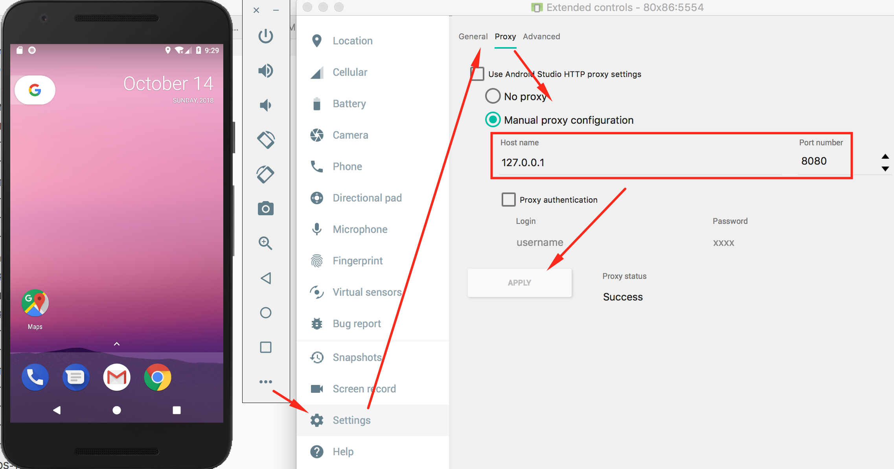
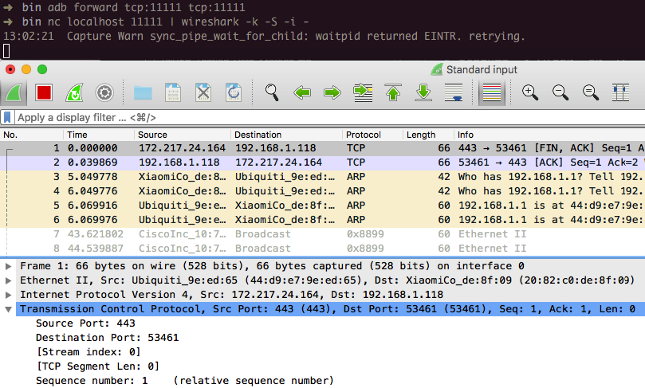

## Setting up a Testing Environment for Android Apps

ここまでで、Androidアプリがどのように構成されデプロイされているかについての基本的な知識が得られたはずです。この章では、セキュリティテスト環境の設定について説明し、これから使用する基本的なテストプロセスについて説明します。この章は後の章で議論されるより詳細なテスト方法の基礎です。

Windows、Linux、またはMac OSを実行しているほとんどすべてのマシンで、完全に機能するテスト環境を設定できます。

#### Software Needed on the Host PC or Mac

最低でも、さまざまなSDKバージョンとフレームワークコンポーネントを管理するための[Android Studio](https://developer.android.com/studio/index.html "Android Studio")(これはAndroid SDKに付属しています)プラットフォームツール、エミュレータ、およびアプリが必要です。Android Studioには、エミュレータ画像を作成するためのAndroid仮想デバイス(AVD)マネージャアプリケーションも付属しています。最新の[SDK tools](https://developer.android.com/studio/index.html#downloads) および [platform tools](https://developer.android.com/studio/releases/platform-tools.html)パッケージがシステムにインストールされていることを確認してください。

#### Setting up the Android SDK

ローカルAndroid SDKのインストールは、Android Studioを介して管理されます。 Android Studioで空のプロジェクトを作成し、"Tools->Android->SDK Manager"を選択してSDKマネージャのGUIを開きます。[SDK Platforms]タブでは、複数のAPIレベルのSDKをインストールします。最近のAPIレベルは以下のとおりです。

- API 23: Android 6.0
- API 24: Android 7.0
- API 25: Android 7.1
- API 26: Android 8.0


インストールされているSDKは次のパスにあります。

```
Windows:

C:\Users\<username>\AppData\Local\Android\sdk

MacOS:

/Users/<username>/Library/Android/sdk
```

注: Linuxでは、SDKディレクトリを選択する必要があります。`/opt`, `/srv`, and `/usr/local`あたりが一般的です。

#### Testing on a Real Device

動的分析のためには、ターゲットアプリを実行するためのAndroidデバイスが必要です。原則として、実物のAndroidデバイスなしで実行し、エミュレータでテストすることができます。ただし、エミュレータ上でのアプリケーションの実行は非常に遅く、これによりセキュリティテストが面倒になる可能性があります。実物のデバイスでテストすることで、プロセスがより円滑になり、より現実的な環境になります。

実際のデバイスでテストするには、*rooting* (つまり、rootユーザーとしてコマンドを実行できるようにOSを変更すること)をお勧めします。これにより、オペレーティングシステムを完全に制御でき、アプリのサンドボックス化などの制限を回避できます。これらの特権により、コードインジェクションや関数フックなどの手法をより簡単に使用できます。

注: root化は危険です。続行する前に、3つの主な影響を明確にする必要があります。root化は次のような悪影響を及ぼします。

- デバイスの保証を無効にする(何らかの措置を取る前に必ず製造元の方針を確認してください)
- 装置を"文鎮"すなわちそれを動作不能および使用不能にする
- 追加のセキュリティリスクを生み出す(組み込みのエクスプロイト緩和策がしばしば削除されるため)

あなたは、あなたの個人情報を保存する個人的なデバイスをroot化するべきではありません。代わりに安価な専用のテスト機器を入手することをお勧めします。GoogleのNexusシリーズのような多くの古いデバイスは、最新のAndroidバージョンを実行でき、テストにはまったく問題ありません。

**あなたのデバイスをroot化することは最終的にあなたの決断であり、OWASPがいかなる損害に対しても決して責任を負わないことを理解する必要があります。よくわからない場合は、root化を始める前に専門家のアドバイスを受けてください。**

###### Which Mobiles Can Be Rooted?

事実上すべてのAndroidデバイスをroot化することができます。Android OSの商用版(カーネルレベルでのLinux OSの進化版)は、モバイルの世界向けに最適化されています。これらのバージョンでは、特権を持たないユーザーが'root'ユーザーになる権限(昇格された特権を持つユーザー)など、一部の機能が削除または無効化されています。デバイスをroot化することは、ユーザがrootユーザになることを可能にすることを意味し、例えば、別のユーザアカウントに変更できる`su`と呼ばれる標準のLinux実行ファイルを追加したりできます。

モバイルデバイスをroot化するには、まずそのブートローダーのロックを解除します。ロック解除手順は、デバイスの製造元によって異なります。ただし、実用的な理由から、特にセキュリティテストに関しては、一部のモバイルデバイスが他のモバイルデバイよりも遥かに人気があります。Googleが作成し、Samsung、LG、Motorolaなどの企業が製造するデバイスが、多くの開発者によって使用されているという理由で最も人気があります。ブートローダのロックが解除されていて、Googleがroot自体をサポートするための多くのツールを提供している場合でも、デバイスの保証は無効になりません。すべての主要ブランドのデバイスroot化に関するガイドの一覧は、[XDA forums](https://www.xda-developers.com/root/ "Guide to rooting mobile devices")にまとめられています。

##### Network Setup

利用可能なネットワーク設定オプションを最初に評価する必要があります。テストに使用するモバイルデバイスと中間プロキシを実行しているマシンは、同じWi-Fiネットワークに接続する必要があります。(既存の)アクセスポイントを使用するか、または[アドホックワイヤレスネットワークを作成します](https://support.portswigger.net/customer/portal/articles/1841150-Mobile%20Set-up_Ad-hoc%20network_OSX.html "Creating an Ad-hoc Wireless Network in OS X")。

ネットワークを設定し、テストマシンとモバイルデバイス間の接続を確立したら、いくつかの手順があります。

- プロキシ設定は[中間プロキシを向くように設定](https://support.portswigger.net/customer/portal/articles/1841101-Mobile%20Set-up_Android%20Device.html "Configuring an Android Device to Work With Burp")する必要があります。
- [中間プロキシのCA証明書は、Androidデバイスの証明書ストレージ内の信頼できる証明書に追加する必要があります](https://support.portswigger.net/customer/portal/articles/1841102-installing-burp-s-ca-certificate-in-an-android-device "Installing Burp's CA Certificate in an Android Device")。CA証明書を保存するために使用されるメニューの場所は、設定メニューのAndroidのバージョンおよびAndroid OEMの変更によって異なります。

これらの手順を完了してアプリを起動すると、リクエストは中間プロキシに表示されます。

#### Testing on the Emulator

ハードウェアテストデバイスを準備するための上記のステップはすべて、エミュレータを使用する場合にも適用されます。エミュレータ環境内でアプリをテストするために使用できるいくつかのツールとVMが動的テストに使用できます。

- MobSF
- Nathan (not updated since 2016)
- AppUse

テスト用にAVDマネージャを使用してAndroid仮想デバイスを作成することもできます。これは[Android Studio内で使用可能](https://developer.android.com/studio/run/managing-avds.html "Create and Manage Virtual Devices")です。

この本の最後にある"ツール"セクションも確認してください。

##### Setting Up a Web Proxy on an Android Virtual Device (AVD)

Android Studio 3.xに同梱されているAndroidエミュレータで機能する次の手順は、エミュレータでHTTPプロキシを設定するためのものです。

1. localhost、たとえばポート8080で待機するようにプロキシを設定します。
2. エミュレータ設定でHTTPプロキシを設定します。
 - エミュレータメニューバーのスリードッツ(3つの点)をクリックします
 - 設定メニューを開きます。
 - "Proxy"タブをクリックします
 - "Manual proxy configuration"を選択します。
 - "Host Name"フィールドに"127.0.0.1"を入力し、"Port number"フィールドにプロキシポートを入力します（例: "8080"）。
 - "Apply"をタップします。



HTTPおよびHTTPSのリクエストは、ホストマシンのプロキシ経由でルーティングされるはずです。そうでない場合は、機内モードのオン/オフを切り替えます。

AVDを起動するときに[emulator command](https://developer.android.com/studio/run/emulator-commandline "Emulator Command")を使用して、AVDのプロキシをコマンドラインで設定することもできます。次の例では、AVD Nexus_5X_API_23を起動し、プロキシを127.0.0.1、ポート8080に設定します。

```shell
$ emulator @Nexus_5X_API_23 -http-proxy 127.0.0.1:8080
```

##### Installing a CA Certificate on the Virtual Device


CA証明書をインストールする簡単な方法は、証明書をデバイスにプッシュし、それをセキュリティ設定を介して証明書ストアに追加することです。たとえば、次のようにPortSwigger(Burp)のCA証明書をインストールできます。

1. Burpを起動し、ホスト上のWebブラウザを使用して http://burp/ に移動してから、'CA Certificate'ボタンをクリックして`cacert.der`をダウンロードします。
2. ファイル拡張子を`.der`から`.cer`に変更します。
3. ファイルをエミュレータにプッシュします。

```shell
$ adb push cacert.cer /sdcard/
```

4. "Settings" -> "Security" -> "Install from SD Card."の順に選択します。
5. 下にスクロールして`cacert.cer`をタップします。

証明書のインストールを確認するように求められます(まだ行っていない場合は、デバイスのPINを設定するように求められます)。

##### Connecting to an Android Virtual Device (AVD) as Root

Android StudioのAVDマネージャを使用してAVDを起動するか、Android SDKのtoolsディレクトリにある`android`コマンドを使用してコマンドラインからAVDマネージャを起動できます。

```shell
$ ./android avd
```

エミュレータが起動して実行されたら、`adb`コマンドでroot接続を確立することができます。

```shell
$ adb root
$ adb shell
root@generic_x86:/ $ id
uid=0(root) gid=0(root) groups=0(root),1004(input),1007(log),1011(adb),1015(sdcard_rw),1028(sdcard_r),3001(net_bt_admin),3002(net_bt),3003(inet),3006(net_bw_stats) context=u:r:su:s0
```

したがって、エミュレータをroot化させることは不要です。rootアクセスは `adb`で確立できます。

##### Restrictions When Testing on an Emulator

エミュレータを使用することにはいくつかの欠点があります。アプリが特定のモバイルネットワークに依存しているか、NFCまたはBluetoothを使用している場合、エミュレータでアプリを正しくテストできない可能性があります。エミュレータ内でのテストも通常は遅くなり、テスト自体が問題を引き起こす可能性があります。

そうであっても、[GPS](https://developer.android.com/studio/run/emulator-commandline.html#geo "GPS Emulation")や[SMS](https://developer.android.com/studio/run/emulator-commandline.html#sms "SMS")のような多くのハードウェア特性をエミュレートすることができます。

### Testing Methods

#### Manual Static Analysis

Androidアプリのセキュリティテストでは、ブラックボックステスト(コンパイル済みバイナリへのアクセスは含むが、元のソースコードは含まないはホワイトボックステストとほぼ同等です。ほとんどのアプリは簡単に逆コンパイルすることができ、リバースエンジニアリングの知識を持ち、バイトコードやバイナリコードにアクセスすることは、リリースビルドが意図的に難読化されていない限り、元のコードを持つのとほぼ同じです。

ソースコードをテストするには、Android SDKとIDEを含むテスト環境を含め、開発者の設定に似た設定が必要です。物理デバイスまたはエミュレータ(アプリのデバッグ用)へのアクセスを推奨します。

**ブラックボックステスト** 中は、元の形式のソースコードにアクセスすることはできません。通常、[Androidの .apk形式](https://en.wikipedia.org/wiki/Android_application_package "Android application package")のアプリケーションパッケージがあります。これは、Androidデバイスにインストールすることも、ソースコードの一部を取得するのに役立つようにリバースエンジニアリングすることもできます。

次のようにして、デバイスからAPKを取得します。

```shell
$ adb shell pm list packages
(...)
package:com.awesomeproject
(...)
$ adb shell pm path com.awesomeproject
package:/data/app/com.awesomeproject-1/base.apk
$ adb pull /data/app/com.awesomeproject-1/base.apk
```

`apkx`はコマンドラインからAPKのソースコードを取得する簡単な方法を提供します。それは `dex2jar`とCFRもパッケージ化し、抽出、変換、そして逆コンパイルのステップを自動化しています。次のようにインストールします。

```
$ git clone https://github.com/b-mueller/apkx
$ cd apkx
$ sudo ./install.sh
```

これは `apkx`を`/usr/local/bin`にコピーするはずです。次のようにテストしたいAPKでそれを実行します。

```shell
$ apkx UnCrackable-Level1.apk
Extracting UnCrackable-Level1.apk to UnCrackable-Level1
Converting: classes.dex -> classes.jar (dex2jar)
dex2jar UnCrackable-Level1/classes.dex -> UnCrackable-Level1/classes.jar
Decompiling to UnCrackable-Level1/src (cfr)
```

アプリケーションがJavaのみに基づいており、ネイティブライブラリ(C/C++コード)がない場合は、リバースエンジニアリングプロセスは比較的簡単で、ほぼすべてのソースコードを復元できます。それにもかかわらず、コードが難読化されていると、このプロセスは非常に時間がかかり非生産的になる可能性があります。これは、ネイティブライブラリを含むアプリケーションにも当てはまります。それらはまだリバースエンジニアリングすることができますが、プロセスは自動化されておらず、低レベル領域に関する詳細な知識が必要です。

"Androidの改ざんとリバースエンジニアリング"セクションには、Androidのリバースエンジニアリングに関する詳細が記載されています。

#### Automated Static Analysis

効率的な静的解析のためにツールを使うべきです。それらはテスターがより複雑なビジネスロジックに集中することを可能にします。オープンソーススキャナーから本格的なエンタープライズ対応スキャナーまで、多数の静的コードアナライザーが利用可能です。仕事に最適なツールは、予算、クライアントの要件、およびテスト担当者の好みによって異なります。

静的アナライザの中には、ソースコードの入手可能性に依存しているものがあります。他は編集されたAPKを入力として取ります。
静的アナライザは、潜在的な問題に集中するのに役立ちますが、すべての問題を自分自身で見つけることができるとは限らないことに注意してください。各調査結果を慎重に確認し、脆弱性を発見する可能性を高めるためにアプリが何をしているのかを理解してください。

誤検知の可能性を減らすために、静的アナライザーを適切に構成してください。また、スキャンでは複数の脆弱性カテゴリのみを選択することもできます。静的アナライザによって生成された結果は、他の方法では圧倒的なものになる可能性があり、手動で大きなレポートを調査しなければならない場合、あなたの努力は逆効果になることがあります。

APKの自動セキュリティ分析のためのオープンソースツールがいくつかあります。

- [QARK](https://github.com/linkedin/qark/ "QARK")
- [Androbugs](https://github.com/AndroBugs/AndroBugs_Framework "Androbugs")
- [JAADAS](https://github.com/flankerhqd/JAADAS "JAADAS")

エンタープライズツールについては、"ツールのテスト"の章の"静的ソースコード分析"を参照してください。

#### Dynamic Analysis

静的解析とは異なり、動的解析はモバイルアプリの実行中に実行されます。テストケースは、ファイルシステムの調査から通信の監視までさまざまです。

HTTP(S)プロトコルに依存するアプリケーションの動的分析をサポートするツールがいくつかあります。最も重要なツールは、いわゆる中間プロキシです。OWASP ZAPとBurp Suite Professionalが最も有名です。中間プロキシは、テスターに中間者の立場を与えます。この位置は、承認、セッション、管理などのテストに使用されるすべてのアプリのリクエストとエンドポイントからのレスポンスを読み取りまたは変更するのに役立ちます。

##### Client Isolation in Wireless Networks

中間プロキシを設定してMITM(中間者)ポジションを取得しただけでは、まだ何も表示できない可能性があります。これはアプリ内の制限によるものかもしれません(次のセクションを参照)が、あなたが接続しているWifiでのいわゆるクライアント分離が原因である可能性もあります。

[ワイヤレスクライアントの隔離](https://documentation.meraki.com/MR/Firewall_and_Traffic_Shaping/Wireless_Client_Isolation "Wireless Client Isolation")は、ワイヤレスクライアントが互いに通信できないようにするセキュリティ機能です。この機能は、ワイヤレスネットワークに接続されているデバイス間の攻撃や脅威を制限するレベルのセキュリティを追加するゲストおよびBYOD SSIDに役立ちます。

テストに必要なWi-Fiにクライアントが分離されている場合はどうするか？

127.0.0.1:8080を指すようにあなたのAndroidデバイス上のプロキシを設定し、あなたのラップトップにUSB経由であなたの携帯電話を接続し、リバースポート転送をするためにadbコマンドを使うことができます。

```shell
$ adb reverse tcp:8080 tcp:8080
```

これが完了すると、Android端末のすべてのプロキシトラフィックは127.0.0.1のポート8080に送信され、ラップトップのadb経由で127.0.0.1:8080にリダイレクトされ、Burpのトラフィックが表示されます。このテクニックを使用すると、クライアントを分離しているWifiでもトラフィックをテストして傍受することができます。

##### Intercepting Non-Proxy Aware Apps

中間プロキシを設定してMITMポジションを取得した後でも、まだ何も表示できない可能性があります。 これは主に以下の理由によるものです。

- アプリは単にAndroid OSのプロキシ設定を使用していないXamarinのようなフレームワークを使用している。
- テストしているアプリが、プロキシが設定されているかどうかを確認していて、今は通信を許可していない。

どちらのシナリオでも、最終的にトラフィックを確認できるようにするには、追加の手順が必要になります。以下のセクションでは、2つの異なる解決策、ettercap と iptablesについて説明します。

トラフィックをリダイレクトするために自分の管理下にあるアクセスポイントを使用することもできますが、これには追加のハードウェアが必要になるため、現在はソフトウェアソリューションに重点を置いています。

> どちらの解決策でも、Burpの Proxyタブ/Options/Edit Interfaceで "Support invisible proxying"を有効にする必要があります。

**iptables**

中間プロキシにすべてのトラフィックをリダイレクトするためにAndroidデバイス上のiptablesを使用することができます。次のコマンドは、ポート80をポート8080で実行中のプロキシにリダイレクトします。

```shell
$ iptables -t nat -A OUTPUT -p tcp --dport 80 -j DNAT --to-destination <Your-Proxy-IP>:8080
```

iptablesの設定を確認し、IPとポートを確認してください。

```shell
$ iptables -t nat -L
Chain PREROUTING (policy ACCEPT)
target     prot opt source               destination

Chain INPUT (policy ACCEPT)
target     prot opt source               destination

Chain OUTPUT (policy ACCEPT)
target     prot opt source               destination
DNAT       tcp  --  anywhere             anywhere             tcp dpt:5288 to:<Your-Proxy-IP>:8080

Chain POSTROUTING (policy ACCEPT)
target     prot opt source               destination

Chain natctrl_nat_POSTROUTING (0 references)
target     prot opt source               destination

Chain oem_nat_pre (0 references)
target     prot opt source               destination
```

iptablesの設定をリセットしたい場合は、ルールをフラッシュすることができます。

```shell
$ iptables -t nat -F
```

**Ettercap**

さらなる準備と ettercap の実行方法については、"ネットワーク通信のテスト"の章とテストケース"中間者攻撃のシミュレート"をお読みください。

プロキシとAndroidデバイスを実行しているマシンは、同じワイヤレスネットワークに接続されている必要があります。以下のコマンドで ettercap を起動し、以下のIPアドレスをAndroidデバイスとワイヤレスネットワークのゲートウェイのIPアドレスに置き換えます。

```shell
$ sudo ettercap -T -i en0 -M arp:remote /192.168.0.1// /192.168.0.105//
```

##### Bypassing Proxy Detection

一部のモバイルアプリは、プロキシが設定されているかどうかを検出しようとしています。そのような場合、これらの設定が悪意のあるものと判断し、正しく機能しないことがあります。

そのような保護メカニズムを迂回するためには、bettercap を設定するか、あなたのAndroid端末にプロキシ設定を必要としない iptables を設定することができます。これまでに言及しなかった3番目の選択肢で、このシナリオでは Frida を使用します。Androidでは、[`ProxyInfo`](https://developer.android.com/reference/android/net/ProxyInfo "ProxyInfo")クラスを問い合わせることによってシステムプロキシが設定されているかどうかを検出し、getHost()メソッドとgetPor()メソッドをチェックすることが可能です。同じタスクを実行するには他にもさまざまな方法があり、実際のクラスとメソッド名を識別するためにAPKを逆コンパイルする必要があります。

以下に、Fridaスクリプトのボイラープレートのソースコードがあります。これは、プロキシが設定されているかどうかを検証し、常にfalseを返すメソッド(この場合はisProxySet)をオーバーロードするのに役立ちます。プロキシが設定されていても、関数はfalseを返すので、アプリは何も設定されていないと見なします。

```javascript
setTimeout(function(){
	Java.perform(function (){
		console.log("[*] Script loaded")

		var Proxy = Java.use("<package-name>.<class-name>")

		Proxy.isProxySet.overload().implementation = function() {
			console.log("[*] isProxySet function invoked")
			return false
		}
	});
});
```

#### Network Monitoring/Sniffing

[tcpdump、netcat(nc)、Wiresharkを使えば、すべてのAndroidトラフィックをリモートでリアルタイムに盗聴することができます](https://blog.dornea.nu/2015/02/20/android-remote-sniffing-using-tcpdump-nc-and-wireshark/ "Android remote sniffing using Tcpdump, nc and Wireshark")。まず、あなたのスマートフォンに[Android tcpdump](https://www.androidtcpdump.com/)の最新版がインストール済みであることを確認してください。 これが[インストール手順](https://wladimir-tm4pda.github.io/porting/tcpdump.html "Installing tcpdump")です。

```shell
$ adb root
$ adb remount
$ adb push /wherever/you/put/tcpdump /system/xbin/tcpdump
```

`adb root`を実行しても`adbd cannot run as root in production builds`というエラーが返される場合は、次のようにtcpdumpをインストールします。

```shell
$ adb push /wherever/you/put/tcpdump /data/local/tmp/tcpdump
$ adb shell
$ su
$ mount -o rw,remount /system;
$ cp /data/local/tmp/tcpdump /system/xbin/
$ cd /system/xbin
$ chmod 755 tcpdump
```

> 注: tcpdumpを使うためには、あなたはスマートフォンのroot権限が必要です！

`tcpdump`を一度実行してそれが機能するかどうかを確認してください。いくつかのパケットが入ってきたら、CTRL+cを押すことでtcpdumpを止めることができます。

```shell
$ tcpdump
tcpdump: verbose output suppressed, use -v or -vv for full protocol decode
listening on wlan0, link-type EN10MB (Ethernet), capture size 262144 bytes
04:54:06.590751 00:9e:1e:10:7f:69 (oui Unknown) > Broadcast, RRCP-0x23 reply
04:54:09.659658 00:9e:1e:10:7f:69 (oui Unknown) > Broadcast, RRCP-0x23 reply
04:54:10.579795 00:9e:1e:10:7f:69 (oui Unknown) > Broadcast, RRCP-0x23 reply
^C
3 packets captured
3 packets received by filter
0 packets dropped by kernel
```

Androidデバイスのネットワークトラフィックをリモートから傍受するには、まず`tcpdump`を実行し、その出力を`netcat`(nc)に送ります。

```shell
$ tcpdump -i wlan0 -s0 -w - | nc -l -p 11111
```
上記のtcpdumpコマンドには、次のものが含まれます。
- wlan0インタフェースをリッスンする
- すべてを取得するためにキャプチャのサイズ(スナップショットの長さ)をバイト単位で定義する(-s0)
- ファイルへの書き込み(-w)。ファイル名の代わりに、`-`を渡します。これは、tcpdumpが標準出力に書き込むようにします。

パイプ(`|`)を使用して、すべての出力をtcpdumpからnetcatに送信しました。これにより、ポート11111でリスナーが開かれます。通常は、wlan0インターフェースを監視する必要があります。別のインターフェースが必要な場合は、`$ ip addr`コマンドで利用可能なオプションをリストアップしてください。

ポート11111にアクセスするには、adbを介してポートを自分のマシンに転送する必要があります。

```shell
$ adb forward tcp:11111 tcp:11111
```

次のコマンドは、netcatを介して転送されたポートに接続し、Wiresharkにパイプ接続します。

```shell
$ nc localhost 11111 | wireshark -k -S -i -
```

Wiresharkはすぐに起動します(-k)。転送されたポートに接続されているnetcatを介してstdin(-i  -)からすべてのデータを取得します。あなたはwlan0インターフェイスからのすべてのデバイスのトラフィックが見れるはずです。



Wiresharkを使用して、キャプチャしたトラフィックを人間が読める形式で表示できます。どのプロトコルが使用されているか、およびそれらが暗号化されていないかどうかを判断します。すべてのトラフィック(TCPおよびUDP)をキャプチャすることは重要です。そのため、テストするアプリケーションのすべての機能を実行して分析する必要があります。


このちょっとしたテクニックは、どの種類のプロトコルが使用されているのか、そしてアプリがどのエンドポイントと通信しているのかを特定できるようにします。問題は、Burpがトラフィックを表示できない場合、どうすればエンドポイントをテストできるのかということです。これに対する簡単な答えはありませんが、使い始めることができるいくつかのBurpプラグインが存在します。

##### Burp Plugins to Process Non-HTTP Traffic

BurpやOWASP ZAPなどの中間プロキシは、デフォルトでは正しくデコードできないため、HTTP以外のトラフィックは表示されません。ただし、次のようなBurpプラグインがあります。

- [Burp-non-HTTP-Extension](https://github.com/summitt/Burp-Non-HTTP-Extension) and
- [Mitm-relay](https://github.com/jrmdev/mitm_relay).

これらのプラグインは非HTPプロトコルを視覚化することができ、あなたはトラフィックを傍受して操作することもできます。

この設定は時に非常に面倒になることがあり、HTTPのテストほど簡単ではないことに注意してください。

##### Firebase/Google Cloud Messaging (FCM/GCM)

Google Cloud Messaging(GCM)の後継であるFirebase Cloud Messaging(FCM)は、Googleが提供する無料のサービスで、アプリケーションサーバーとクライアントアプリの間でメッセージをやり取りすることを可能にします。 サーバーとクライアントのアプリは、ダウンストリームおよびアップストリームのメッセージを処理するFCM/GCM接続サーバーを介して通信します。


ダウンストリームメッセージ(プッシュ通知)はアプリケーションサーバーからクライアントアプリに送信されます。アップストリームメッセージはクライアントアプリからサーバーに送信されます。

FCMはAndroid、iOS、およびChromeで利用できます。FCMは現在、HTTPとXMPPの2つの接続サーバープロトコルを提供しています。[公式ドキュメント](https://firebase.google.com/docs/cloud-messaging/server#choose "Differences of HTTP and XMPP in FCM")で説明されているように、これらのプロトコルは異なる方法で実装されています。次の例は、両方のプロトコルを傍受する方法を示しています。

**Preparation of Test Setup**

あなたの電話の iptables を設定するか、トラフィックを傍受することができるように ettercap を使う必要があります。

FCMはXMPPまたはHTTPを使用してGoogleバックエンドと通信できます。

**HTTP**

FCMはHTTP通信にポート5228、5299、および5230を使用します。通常はポート5228だけが使用されます。

- FCMによって使用されるポートのローカルポート転送を設定します。次の例はMac OS Xに適用されます。

```shell
$ echo "
rdr pass inet proto tcp from any to any port 5228-> 127.0.0.1 port 8080
rdr pass inet proto tcp from any to any port 5229 -> 127.0.0.1 port 8080
rdr pass inet proto tcp from any to any port 5239 -> 127.0.0.1 port 8080
" | sudo pfctl -ef -
```

- 中間プロキシは、上記のポート転送ルールで指定されているポート(ポート8080)をリッスンする必要があります。

**XMPP**

XMPP通信の場合、[FCMの使用するポート](https://firebase.google.com/docs/cloud-messaging/xmpp-server-ref "Firebase via XMPP")は、5235(実動)および5236(テスト)です。

- FCMによって使用されるポートのローカルポート転送を設定します。 次の例はMac OS Xに適用されます。

```shell
$ echo "
rdr pass inet proto tcp from any to any port 5235-> 127.0.0.1 port 8080
rdr pass inet proto tcp from any to any port 5236 -> 127.0.0.1 port 8080
" | sudo pfctl -ef -
```

- 中間プロキシは、上記のポート転送ルールで指定されているポート(ポート8080)をリッスンする必要があります。

アプリを起動し、FCMを使用する機能を起動します。中間プロキシにHTTPメッセージが表示されるはずです。


##### Drozer

[Drozer](https://github.com/mwrlabs/drozer "Drozer on GitHub")は、他のアプリケーションのIPCエンドポイントおよび基盤となるOSと対話するサードパーティ製のアプリケーションの役割を引き受けることによって、アプリケーションおよびデバイスのセキュリティの脆弱性を検索することを可能にするAndroidセキュリティ評価フレームワークです。次のセクションでは、Drozerのインストールと使用に必要な手順について説明します。

###### Installing Drozer

**On Linux:**

[Drozer website](https://labs.mwrinfosecurity.com/tools/drozer/ "Drozer Website")には、多くのLinuxディストリビューション用のビルド済みパッケージがあります。あなたのディストリビューションがリストされていない場合は、次のようにソースからDrozerを構築することができます。

```
git clone https://github.com/mwrlabs/drozer/
cd drozer
make apks
source ENVIRONMENT
python setup.py build
sudo env "PYTHONPATH=$PYTHONPATH:$(pwd)/src" python setup.py install
```

**On Mac:**

Macでは、Drozer は依存関係が欠けているためインストールが少し難しくなります。El Capitan以降のMac OSバージョンにはOpenSSLがインストールされていないため、pyOpenSSLのコンパイルは機能しません。この問題を解決するには、[OpenSSLを手動でインストールします]。openSSLをインストールするには、次のコマンドを実行してください。

```
$ brew install openssl
```

Drozerはいくつかの古いバージョンのライブラリに依存しています。自作でPythonをインストールし、virtualenvで専用の環境を作成することで、システムのPythonインストール環境を滅茶苦茶にしないよう配慮しましょう。([pyenv](https://github.com/pyenv/pyenv "pyenv")のようなPythonのバージョン管理ツールを使うのは良い方法ですが、これはこのガイドの範囲を超えています)。

pipでvirtualenvをインストールしてください。

```
$ pip install virtualenv
```

作業するプロジェクトディレクトリを作成します。いくつかのファイルをそこにダウンロードします。新しく作成されたディレクトリに移動してコマンド`virtualenv drozer`を実行します。これにより、"drozer"フォルダが作成され、そこにPythonの実行可能ファイルとpipライブラリのコピーが含まれます。

```
$ virtualenv drozer
$ source drozer/bin/activate
(drozer) $
```

これで、必要なバージョンのpyOpenSSLをインストールし、以前にインストールしたOpenSSLヘッダに対してビルドする準備が整いました。pyOpenSSLバージョンのDrozerのソースにタイプミスがあると、正常にコンパイルできなくなるので、コンパイルする前にソースを修正する必要があります。幸いなことに、ropnopは必要なステップを考え出し、それらを[blog post](https://blog.ropnop.com/installing-drozer-on-os-x-el-capitan/ "ropnop Blog - Installing Drozer on OS X El Capitan")にドキュメント化しました。
以下のコマンドを実行してください。

```
$ wget https://pypi.python.org/packages/source/p/pyOpenSSL/pyOpenSSL-0.13.tar.gz
$ tar xzvf pyOpenSSL-0.13.tar.gz
$ cd pyOpenSSL-0.13
$ sed -i '' 's/X509_REVOKED_dup/X509_REVOKED_dupe/' OpenSSL/crypto/crl.c
$ python setup.py build_ext -L/usr/local/opt/openssl/lib -I/usr/local/opt/openssl/include
$ python setup.py build
$ python setup.py install
```

邪魔にならないように、残りの依存関係をインストールすることができます。

```
$ easy_install protobuf==2.4.1 twisted==10.2.0
```

最後に、MWRラボのWebサイトからPythonの.eggをダウンロードしてインストールします。

```
$ wget https://github.com/mwrlabs/drozer/releases/download/2.3.4/drozer-2.3.4.tar.gz
$ tar xzf drozer-2.3.4.tar.gz
$ easy_install drozer-2.3.4-py2.7.egg
```

**Installing the Agent:**

Drozerエージェントは、デバイス自体で動作するソフトウェアコンポーネントです。最新のDrozer Agentを[こちら](https://github.com/mwrlabs/drozer/releases/)からダウンロードして、adbでインストールしてください。

```
$ adb install drozer.apk
```

**Starting a Session:**

これで、Drozerコンソールがホストコンピュータにインストールされ、エージェントがUSB接続デバイスまたはエミュレータ上で実行されるはずです。今度は調査を始めるために2つを接続する必要があります。

実行中のエミュレータでDrozerアプリケーションを開き、アプリケーションの下部にあるOFFボタンをクリックしてEmbedded Serverを起動します。


サーバーはデフォルトでポート31415で待機します。adbを使用してこのポートをlocalhostインターフェースに転送してから、ホスト上でDrozerを実行してエージェントに接続します。

```shell
$ adb forward tcp:31415 tcp:31415
$ drozer console connect
```

現在のセッションで実行できるすべてのDrozerモジュールを表示するには、 "list"コマンドを使用します。

**Basic Drozer Commands:**

- エミュレータにインストールされているすべてのパッケージを一覧表示するには、次のコマンドを実行します。

	`dz> run app.package.list`

- 特定のアプリのパッケージ名を見つけるには、"-f"と検索文字列を渡します。

	`dz> run app.package.list –f (string to be searched)`

- パッケージに関する基本情報を見るには、次のコマンドを実行します。

  	`dz> run app.package.info –a (package name)`

- エクスポートされたアプリケーションコンポーネントを識別するには、次のコマンドを実行します。

  	`dz> run app.package.attacksurface (package name)`

- ターゲットアプリケーションでエクスポートされたActivityのリストを特定するには、次のコマンドを実行します。

  	`dz> run app.activity.info -a (package name)`

- エクスポートしたアクティビティを起動するには、次のコマンドを実行します。

   	`dz> run app.activity.start --component (package name) (component name)`

- ターゲットアプリケーションでエクスポートされたブロードキャストレシーバのリストを特定するには、次のコマンドを実行します。

    `dz> run app.broadcast.info -a (package name)`

- ブロードキャストレシーバにメッセージを送信するには、次のコマンドを実行します。

	`dz> run app.broadcast.send --action (broadcast receiver name) -- extra (number of arguments)`

**Using Modules:**

インストール直後の状態でも、DrozerはAndroidプラットフォームのさまざまな側面といくつかのリモートエクスプロイトを調査するためのモジュールを提供します。追加のモジュールをダウンロードしてインストールすることで、Drozerの機能を拡張することができます。

**Finding Modules:**

公式のDrozerモジュールリポジトリはGitHubのメインプロジェクトと一緒にホストされています。これはあなたのDrozerのコピーに自動的に設定されます。モジュールを検索するには `module`コマンドを使います。

```shell
dz> module search tool
kernelerror.tools.misc.installcert
metall0id.tools.setup.nmap
mwrlabs.tools.setup.sqlite3
```

モジュールの詳細については、モジュールの説明を見るために `-d`オプションを渡してください：

```
dz> module  search url -d
mwrlabs.urls
    Finds URLs with the HTTP or HTTPS schemes by searching the strings
    inside APK files.

        You can, for instance, use this for finding API servers, C&C
    servers within malicious APKs and checking for presence of advertising
    networks.

```

**Installing Modules:**

`module`コマンドでモジュールをインストールすることができます。

```
dz> module install mwrlabs.tools.setup.sqlite3
Processing mwrlabs.tools.setup.sqlite3... Already Installed.
Successfully installed 1 modules, 0 already installed
```

これはクエリにマッチするモジュールをインストールします。新しくインストールされたモジュールはコンソールに動的にロードされ、すぐに利用可能になります。

#### Potential Obstacles

テストしようとしているアプリに実装されている可能性がある次のセキュリティ制御用のデバッグビルドを提供する可能性について、プロジェクトチームと話し合ってください。デバッグビルドは、より包括的な分析を可能にすることによって(ホワイトボックス)テストにいくつかの利点をもたらします。

##### Certificate Pinning

アプリが証明書ピン留めを実装している場合、中間プロキシによって提供されたC.509証明書は拒否され、アプリはプロキシ経由の要求を拒否します。効率的なホワイトボックステストを実行するには、証明書ピン留めを無効化したデバッグビルドを使用します。

ブラックボックステストで証明書の固定を回避する方法はいくつかあります。たとえば、[SSLUnpinning](https://github.com/ac-pm/SSLUnpinning_Xposed "SSLUnpinning") や [Android-SSL-TrustKiller](https://github.com/iSECPartners/Android-SSL-TrustKiller "Android-SSL-TrustKiller")です。証明書のピン留めはすぐに回避できますが、これはアプリがこれらのツールでカバーされているAPI機能を使用している場合に限られます。これらのツールがまだ実装していないフレームワークまたはライブラリを使用してアプリがSSL固定を実装している場合は、手動でパッチを適用して無効化する必要があるため、時間がかかります。

手動で証明書のピン留めを無効にする方法は2つあります。
- アプリの実行中に[Frida](https://www.frida.re/docs/android/ "Frida") や [ADBI](https://github.com/crmulliner/adbi "ADBI")を使用した動的パッチ適用
- [SmalliコードでのSSL固定ロジックの特定、パッチの適用、およびAPKの再組み立て](https://serializethoughts.com/2016/08/18/bypassing-ssl-pinning-in-android-applications/ "Bypassing SSL Pinning in Android Applications")

証明書のピン留めを無効にすると、動的分析の前提条件が満たされ、その後アプリの通信を調査できます。

詳細については、テストケース"カスタム証明書ストアと証明書固定のテスト"を参照してください。

##### Root Detection

ルート検出方法の広範なリストは、"Androidでの反リバース防御のテスト"の章にあります。

一般的なモバイルアプリのセキュリティビルドでは、通常、ルート検出を無効にしてデバッグビルドをテストします。そのようなビルドがテストに利用できない場合は、この本の後半で紹介するさまざまな方法でルート検出を無効にすることができます。
