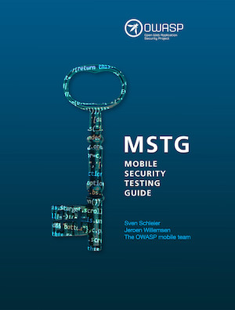

<a href="https://leanpub.com/mobile-security-testing-guide"></a>


# OWASP Mobile Security Testing Guide [](https://twitter.com/OWASP_MSTG)
[](http://creativecommons.org/licenses/by-sa/3.0/ "CC-by-SA 3")
[](https://www.owasp.org/index.php/Category:OWASP_Project#tab=Project_Inventory)
[](https://travis-ci.com/OWASP/owasp-mstg)


現在閲覧しているサイトはOWASP Mobile Security Testing Guide (以下、「MSTG」という)の公式なGitHubレポジトリになります。MSTGはモバイルアプリ向けのセキュリティテストやリバースエンジニアリングのための包括的なマニュアルで、[OWASP Mobile Application Verification Standard (MASVS)](https://github.com/OWASP/owasp-masvs "MASVS")に記載されているコントロールを検証するための技術的プロセスについて説明しています。MSTGは以下で閲覧もしくは電子書籍としてダウンロード可能です。

*  [Gitbook: https://mobile-security.gitbook.io/mobile-security-testing-guide/ "MSTG @ Gitbook"](https://mobile-security.gitbook.io/mobile-security-testing-guide/ "MSTG @ Gitbook")
* [e-book: https://leanpub.com/mobile-security-testing-guide-preview "MSTG as an e-book"](https://leanpub.com/mobile-security-testing-guide-preview "MSTG as an e-book")


## 目次

### 導入

- [Header](Document/0x00-Header.md)
- [Foreword: 前文](Document/Foreword.md)
- [Frontispiece: はじめに](Document/0x02-Frontispiece.md)
- [Introduction to the Mobile Security Testing Guide: MSTGの導入](Document/0x03-Overview.md)
- [Mobile App Taxonomy: モバイルアプリの分類](Document/0x04a-Mobile-App-Taxonomy.md)
- [モバイルアプリのセキュリティテスト](Document/0x04b-Mobile-App-Security-Testing.md)

### テストガイド(共通)

- [Mobile App Authentication Architectures: モバイルアプリの認可機構](Document/0x04e-Testing-Authentication-and-Session-Management.md)
- [Testing Network Communication: 通信の検証](Document/0x04f-Testing-Network-Communication.md)
- [Cryptography in Mobile Apps: モバイルアプリ内の暗号化](Document/0x04g-Testing-Cryptography.md)
- [Testing Code Quality: コード品質の検証](Document/0x04h-Testing-Code-Quality.md)
- [Tampering and Reverse Engineering: 改ざんやリバースエンジニアリング](Document/0x04c-Tampering-and-Reverse-Engineering.md)
- [Testing User Education:  ユーザ教育の検証](Document/0x04i-Testing-user-interaction.md)

### テストガイド(Android)

- [Platform Overview: プラットフォームの概要](Document/0x05a-Platform-Overview.md)
- [Setting up a Testing Environment for Android Apps: Androidアプリ検証の環境構築](Document/0x05b-Basic-Security_Testing.md)
- [Data Storage on Android: データストレージ](Document/0x05d-Testing-Data-Storage.md)
- [Android Cryptographic APIs:暗号化API](Document/0x05e-Testing-Cryptography.md)
- [Local Authentication on Android: ローカル認可](Document/0x05f-Testing-Local-Authentication.md)
- [Android Network APIs: ネットワークAPI](Document/0x05g-Testing-Network-Communication.md)
- [Android Platform APIs: プラットフォームAPI](Document/0x05h-Testing-Platform-Interaction.md)
- [Code Quality and Build Settings for Android Apps: コード品質とビルド設定](Document/0x05i-Testing-Code-Quality-and-Build-Settings.md)
- [Tampering and Reverse Engineering on Android: 改ざんとリバースエンジニアリング](Document/0x05c-Reverse-Engineering-and-Tampering.md)
- [Android Anti-Reversing Defenses: アンチリバースエンジニアリング対策](Document/0x05j-Testing-Resiliency-Against-Reverse-Engineering.md)

### テストガイド(iOS)

- [Platform Overview: プラットフォームの概要](Document/0x06a-Platform-Overview.md)
- [Setting up a Testing Environment for iOS Apps: iOSアプリ検証の環境構築](Document/0x06b-Basic-Security-Testing.md)
- [Data Storage on iOS: データストレージ](Document/0x06d-Testing-Data-Storage.md)
- [iOS Cryptographic APIs: 暗号化API](Document/0x06e-Testing-Cryptography.md)
- [Local Authentication on iOS: ローカル認可](Document/0x06f-Testing-Local-Authentication.md)
- [iOS Network APIs: ネットワークAPI](Document/0x06g-Testing-Network-Communication.md)
- [iOS Platform APIs: プラットフォームAPI](Document/0x06h-Testing-Platform-Interaction.md)
- [Code Quality and Build Settings for iOS Apps: コード品質とビビルド環境](Document/0x06i-Testing-Code-Quality-and-Build-Settings.md)
- [Tampering and Reverse Engineering on iOS: 改ざんとリバース・エンジニアリング対策](Document/0x06c-Reverse-Engineering-and-Tampering.md)
- [iOS Anti-Reversing Defenses: アンチリバースエンジニアリング対策](Document/0x06j-Testing-Resiliency-Against-Reverse-Engineering.md)

### 付録

- [Testing Tools: 検証ツール](Document/0x08-Testing-Tools.md)
- [Suggested Reading: 参考文献](Document/0x09-Suggested-Reading.md)

## Reading the Mobile Security Testing Guide

MSTGの1.0版は、2018年6月に発行されました。The release 1.0 of the MSTG was published in June 2018。複数の形式で閲覧することが可能です。

1.  [Gitbook](https://mobile-security.gitbook.io/mobile-security-testing-guide/ "Gitbook")で読む。: メインリポジトリとGitbookは同期されており最新の状態で閲覧できます。

2. [releases](https://github.com/OWASP/owasp-mstg/releases "Our releases")を確認する。: こちらには、任意のタグ付きバージョンごとにPDFやソースを含むアーカイブ、docxファイルなどがあります。ドキュメントはタグごとに自動的に生成されています。

3. [e-book](https://leanpub.com/mobile-security-testing-guide-preview "MSTG as an e-book")を入手する。: e-bookは無料で入手可能ですが、本プロジェクトを支援するために支援額を指定して購入することも可能です。e-bookの販売を通じて得られた資金は、すべてプロジェクト予算に直接投入され、将来のリリースの資金調達として利用されます。

3. レポジトリをクローンして [document generator](https://github.com/OWASP/owasp-mstg/blob/master/Tools/generate_document.sh "The document generator") (requires [pandoc](http://pandoc.org "Pandoc"))を実行する。: これによりGeneratedサブディレクトリにdocxファイルとHTMLファイルが生成されます。

```bash
$ git clone https://github.com/OWASP/owasp-mstg/
$ cd owasp-mstg/Tools/
$ ./generate_document.sh
```

4. レポジトリをクローンして [gitbook generator](https://github.com/OWASP/owasp-mstg/blob/master/Tools/gitbookepubandpdf.sh "Gitbook based")を実行する。: これによりGeneratedサブディレクトリにPDFファイル、Epubファイル、Mobiファイルが生成されます。

```bash
$ git clone https://github.com/OWASP/owasp-mstg/
$ cd owasp-mstg/Tools/
$ ./gitbookandpdf.sh
```

[document index](https://rawgit.com/OWASP/owasp-mstg/master/Generated/OWASP-MSTG-Table-of-Contents.html "TOC") を利用してMSTGのマスターブランチをナビゲートすることも可能です。

## Contributions, feature requests and feedback

**我々は著者、レビュワー、編集者などを募集しています** 取り組まれる場合は、まずは [existing content](https://mobile-security.gitbook.io/mobile-security-testing-guide/ "existing content")あたりをご確認ください。また、[issues](https://github.com/OWASP/owasp-mstg/issues "our issues section") や[project page](https://github.com/OWASP/owasp-mstg/projects/2 "The MSTG Project") のチェックも重要です。

あなたが作業を開始する前に、[Slackチャンネル](https://owasp.slack.com/messages/project-mobile_omtg/details/ "Come to Slack!")に我々を登録してください。これは、誰が何をしているのかを追跡し、競合を防止するのに役立ちます。以下からSlackアカウントを作成することができます。

https://owasp.slack.com/

あなたが作業を行う前にこちらの [style guide](https://github.com/OWASP/owasp-mstg/blob/master/style_guide.md "Style Guide") に目を通してください。基本的な記述ルールが書かれています。

MSTGは主にネイティブアプリにフォーカスしています。ネイティブアプリとは、Android SDKを用いてJavaやKotlinで構築されたアプリもしくはApple SDKを用いてSwiftやObjective-Cで構築されたアプリを指します。NativescriptやReact-native、XamarinやCordovaなどはMSTGのフォーカスには含まれていません。しかし、pinningなどのキーコントロールについてはこれらのプラットフォーム上の問題として既に説明されています。

もしあなたがこのガイドに追加して欲しい事項がある場合や改善を提案したい場合、[issue](https://github.com/OWASP/owasp-mstg/issues "Issue")でissueを立てるか、[Slack](https://owasp.slack.com/messages/project-mobile_omtg/details/ "Come to our Slack!")で連絡してください。
もし、issueがacceptされた場合、[milestones](https://github.com/OWASP/owasp-mstg/milestones "Milestones")にその計画を反映します。

### Translating

現在の目標は、6ヶ月ごとにマイナーリリースを1つ発行することです。次に、PDFやdocx形式のドキュメントを更新するためのパッチを適宜提供していきます。そして、タグ付けされたリリースは、優先言語に翻訳することができるようになります。（意味論的なバージョン管理を使用しています。
(メジャーバージョン、マイナーバージョンに係わらずセマンティックバージョニングを利用していきます)


### Contributing

- ( https://github.com/[my-github-username]/owasp-mstg/ )をフォークしてください。
- 機能別ブランチを作成する（git checkout -b my-new-feature）
- 変更をコミットする（git commit --am 'Add some feature'）
- ブランチにプッシュする（git push origin my-new-feature）
- 新しいプルリクエストを作成する
- プロジェクトリーダーはマージする前にQAを行いフィードバックします。

## Authoring Credit

Contributorは、GitHubによって記録されたそのcontributionに基き、謝辞一覧に追加されます。氏名の一覧は、追加された行数でソートされます。Authorは次のように分類されます：

- プロジェクトリーダー/Author: ガイドの開発を継続的に管理し、大量のコンテンツを作成する。
- 共著者: 質の高いコンテンツ、[少なくとも2,000件の追加ログ](https://github.com/OWASP/owasp-mstg/graphs/contributors "Co-author")に一貫して貢献する。
- トップコントリビュータ: 質の高いコンテンツ、[少なくとも500件の追加されたログ](https://github.com/OWASP/owasp-mstg/graphs/contributors "Top Contributor")に一貫して貢献する。
- コントリビュータ：任意の形式の投稿、[少なくとも50の追加ログ](https://github.com/OWASP/owasp-mstg/graphs/contributors "Contributor")を行う。
- ミニコントリビュータ：50件以下のすべての貢献。例えば、1つの単語または1文のコミットなどでもよい。
- レビュアー：自分のプルリクエストを提出していないが、問題を作成したり、他の方法で有益なフィードバックを与える。

Authoring Creditの一覧に名前がなかったり間違った列に掲載されていた場合は、我々に連絡をするかプルリクエストを作成してください。(頻繁に更新してはいますがリアルタイムというわけではありません。)

ガイドの多くのコンテンツを記載し、プロジェクトの確実な推進に貢献したい場合、Authorとして参加できます。数ヶ月にわたって多くの時間が必要になるであろうことに注意してください。詳細については、Sven Schleier (Slack: *sushi2k*)またはJeroen Willemsen  (Slack: *jeroenwillemsen*) に連絡してください。

## Crackmes

Crackmesフォルダには、ハッキング演習用のモバイルアプリがあります。あなたは隠された秘密を見つけることができますか？詳細はこちら:

[Crackmes folder](https://github.com/OWASP/owasp-mstg/blob/master/Crackmes "Crackmes folder")内の[README.md](https://github.com/OWASP/owasp-mstg/blob/master/Crackmes/README.md "Crackmes readme")をチェックしてください。
